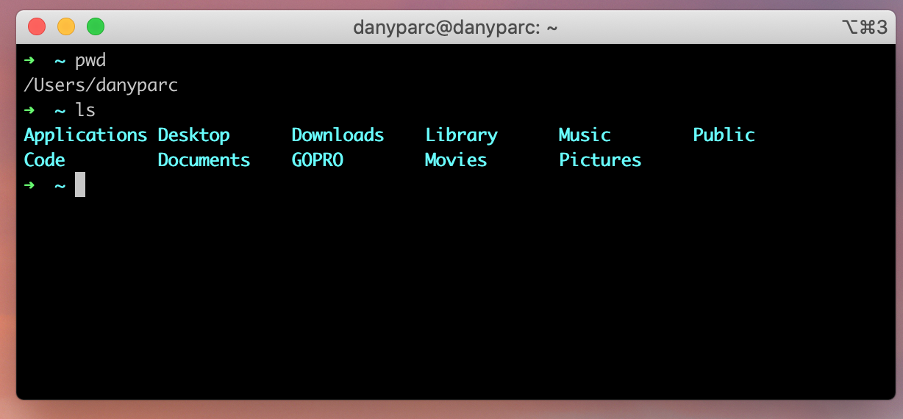
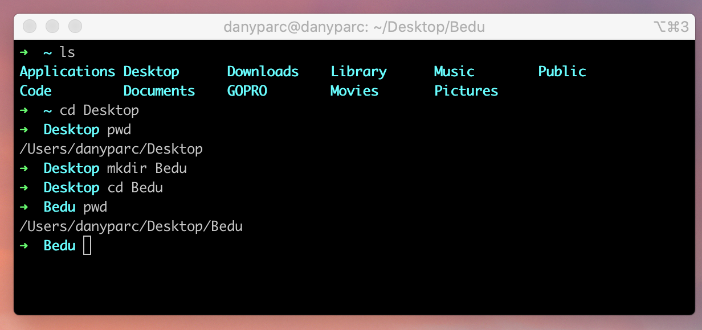
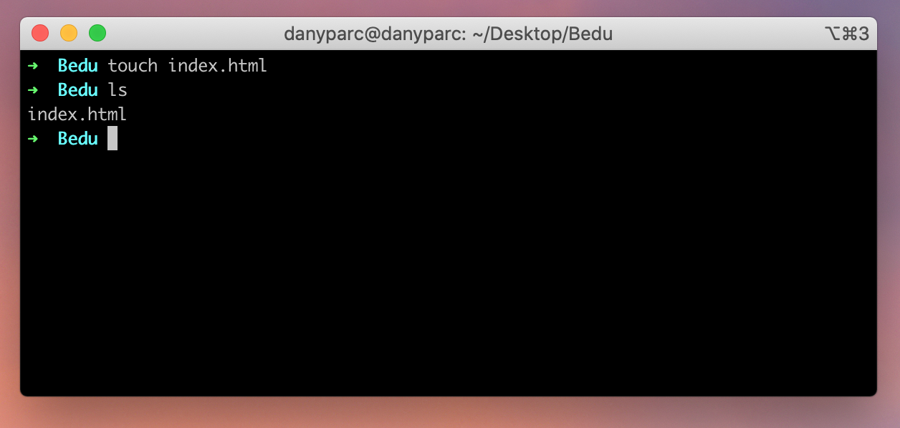
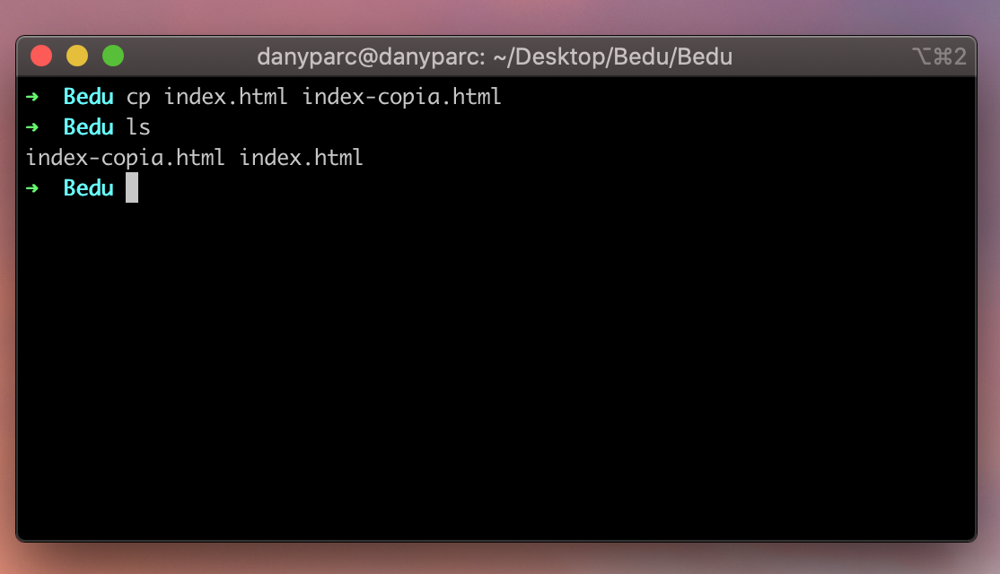
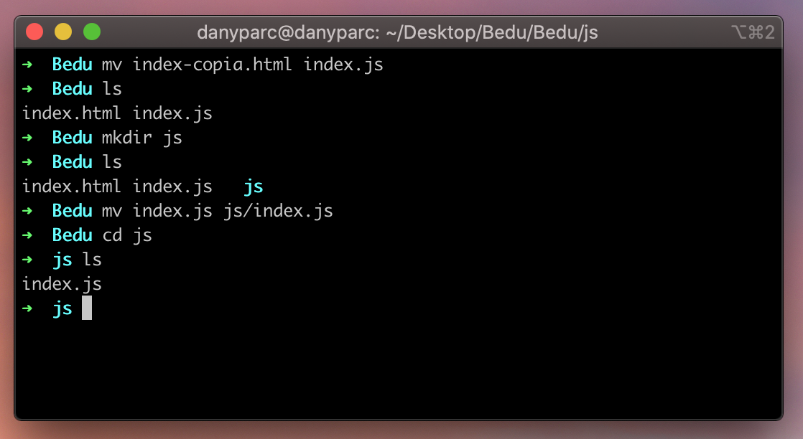
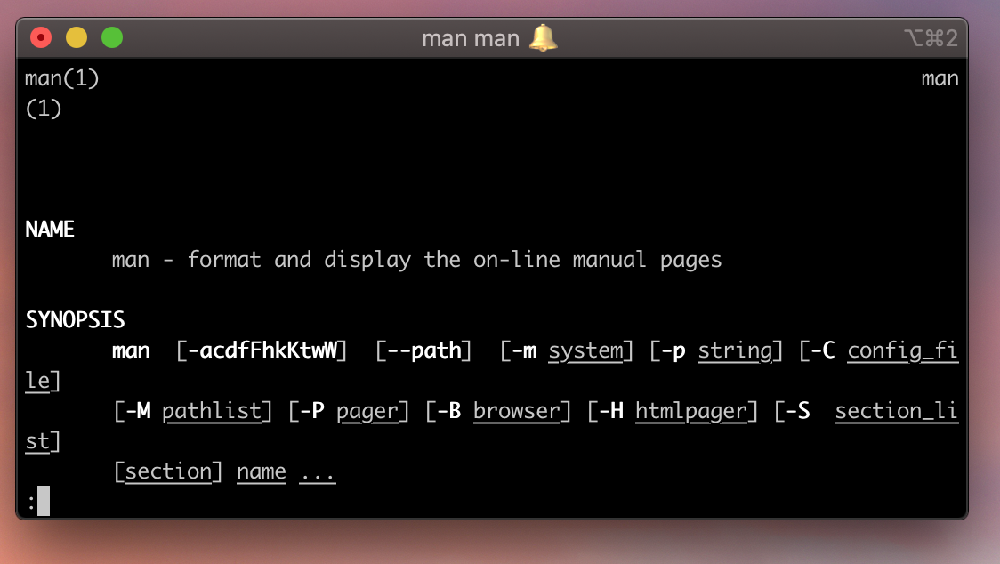

[`Backend Fundamentals`](../../README.md) > [`Sesión 01: Consola`](../README.md) > `Ejemplo 1`

# Requerimientos

- Tener **instalado** sistema operativo **Linux** o **MacOS**.

# Desarrollo

# Navegación (File system)

- Para navegar en el sistema de archivos de nuestro sistema operativo podemos utilizar **los siguientes comandos:**

## `ls`

Lista el contenido del directorio dónde estamos posicionados.

## `cd`

Nos permite posicionarnos en una ruta en específico, o *entrar* en una carpeta.

**Sintaxis básica:** `cd [ruta o nombre de la carpeta]`

>💡 **Nota:**
>
>Para volver volver atrás en una ruta utilizamos `cd ..`
>
>Explicar la diferencia entre rutas relativas y rutas absolutas.
>
>En windows los comandos tienen diversas variaciones. Si tienes problemas basta con googlear para buscar su equivalente.
>

## `mkdir`

Crea una nueva carpeta.

**Sintaxis básica:** `mkdir [nombre carpeta]`

## `touch`

Crea un nuevo archivo.

**Sintaxis básica:** `touch [nombre del archivo con extensión]`

## `cp`

Copia un nuevo archivo.

**Sintaxis básica:** `cp [ruta del archivo a copiar] [nueva ruta]`

## `mv`

Mover o renombrar archivos.

**Sintaxis básica:** `mv [ruta del archivo] [nueva ruta / nuevo nombre]`

## `rm`

Eliminar un archivo. Con la opción `-r` podemos también eliminar folders y sus contenidos de manera *recursiva.*

**Sintaxis básica:** `rm [opciones] [ruta del archivo]`

## `man`

Despliega información del manual de algún comando

**Sintaxis Básica:** `man [nombre del comando]`

El siguiente ejemplo `man man` despliega el manual del mismo comando `man`

[`Atrás: Sesión 01`](https://github.com/beduExpert/A2-Backend-Fundamentals-2020/tree/master/Sesion-01) | [`Siguiente: Reto-01`](../Reto-01)
