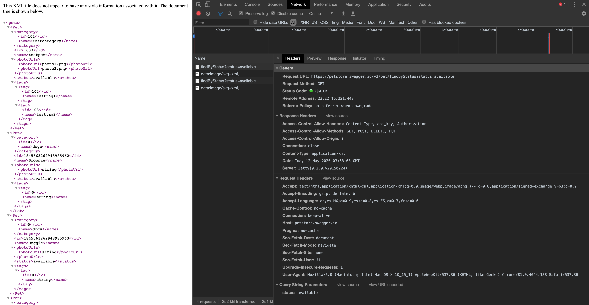
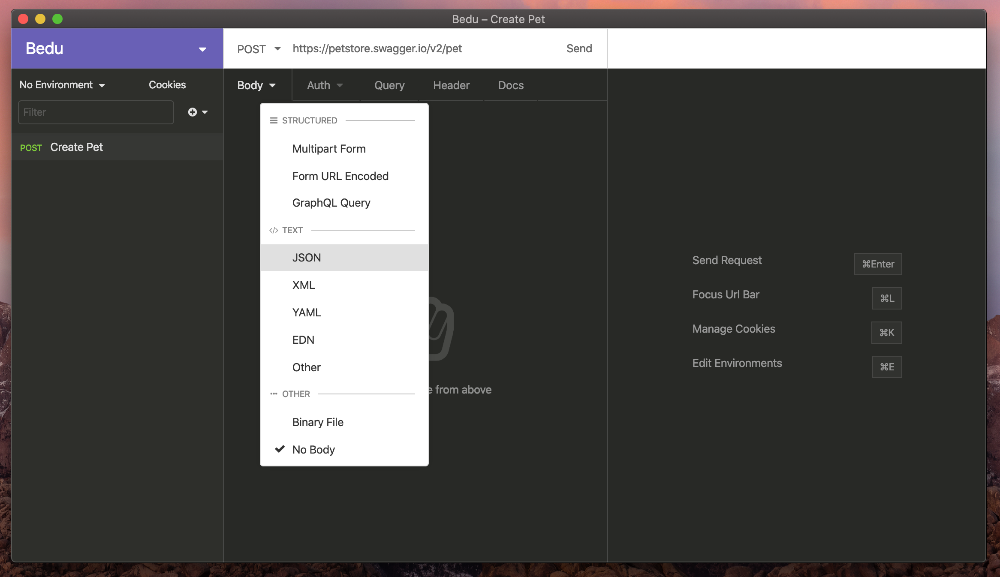
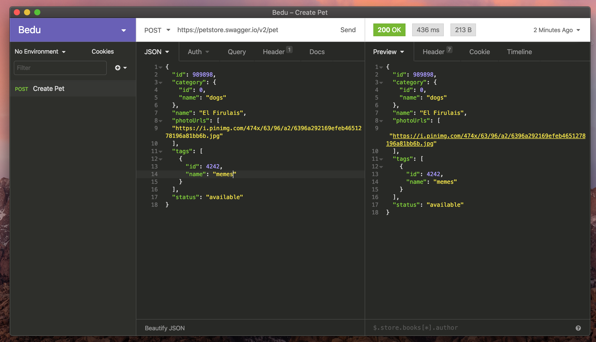

[`Backend Fundamentals`](../../README.md) > [`Sesión 01`](../README.md) > `Ejemplo 2`

# Ejemplo 2: Peticiones

### Listando animalitos

Listaremos animales haciendo peticiones a una API pública: 

1. Abriremos una nueva pestaña de nuestro navegador

2. Abrimos el inspector de elementos y nos dirigiremos a la pestaña *Network*

3. Abrimos el [siguiente enlace:](https://petstore.swagger.io/v2/pet/findByStatus?status=available)

4. Observar que es lo que sucede

5. En la pestaña de *Network* dar click en la primera petición, analizar los campos del request y de la respuesta.




### Utilizando un cliente de peticiones

1. Elegiremos e instalaremos alguno de los siguientes clientes de peticiones HTTP/HTTPS
    - [Insomnia Core](https://insomnia.rest/)
    - [Postman](https://www.postman.com/)

2. Añadiremos una nueva mascota haciendo una petición `POST` en el siguiente URL: [https://petstore.swagger.io/v2/pet](https://petstore.swagger.io/v2/pet)



El cuerpo de la petición estará en formato JSON y será cómo el siguiente:

```jsx
{
   "id": 989898,
    "category": {
      "id": 0,
      "name": "dogs"
    },
    "name": "El Firulais",
    "photoUrls": [
    "https://i.pinimg.com/474x/63/96/a2/6396a292169efeb4651278196a81bb6b.jpg"
    ],
    "tags": [
      {
        "id": 4242,
        "name": "memes"
      }
    ],
    "status": "available"
}
```

Consulta la [Documentación](https://petstore.swagger.io/#/) de la API, para que veas como funcionan los servicios de ésta.

Una vez ejecutada la petición, obtendremos una respuesta `200` si todo ha salido bien



-------

[`Atrás: Sesión 03`](../README.md) | [`Siguiente: Reto-02`](../Reto-02)

