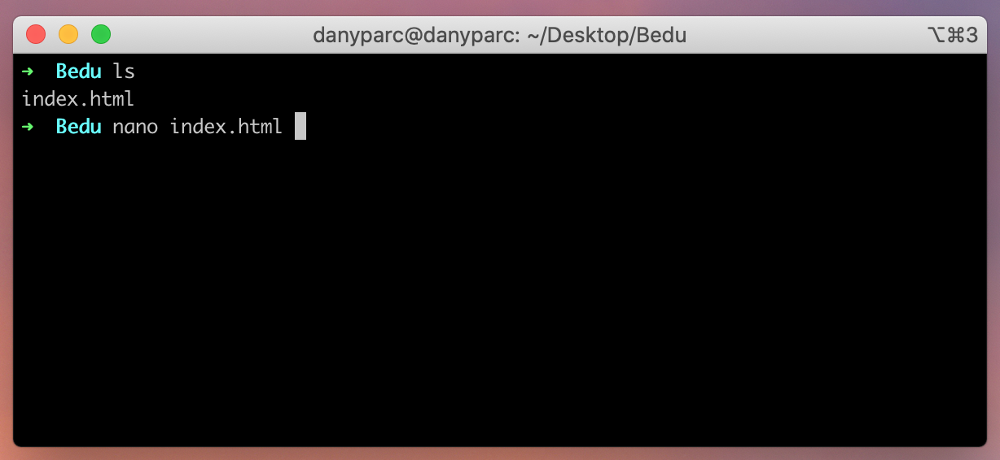
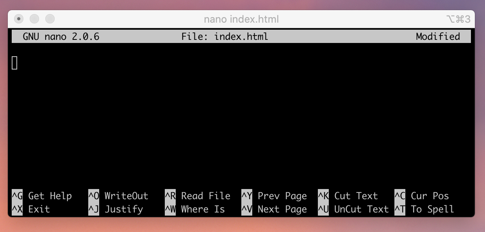
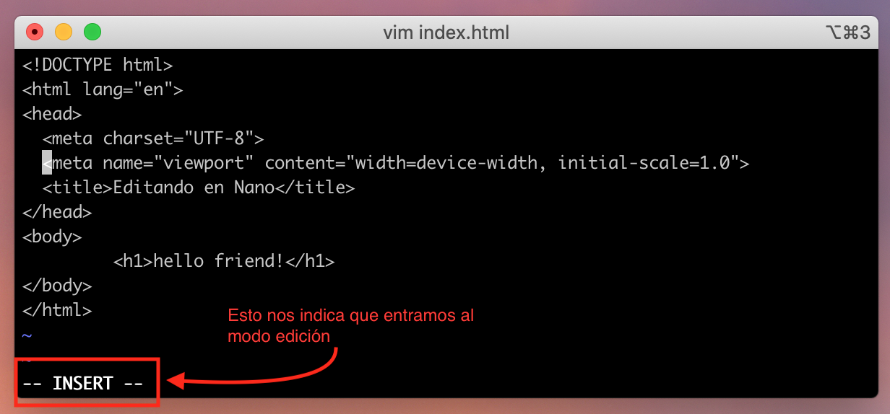
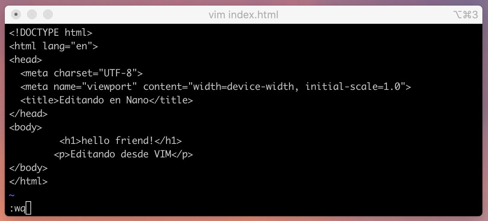

[`Backend Fundamentals`](../../README.md) > [`Sesión 01: Consola`](../README.md) `Ejemplo 02`

# Requerimientos

- Tener **instalado** sistema operativo **Linux** o **MacOS**.

# Desarrollo

# Editando Archivos

- En Linux y MacOS existen diversas maneras de editar un archivo sin necesidad de **salir de la terminal.**

## nano

**Sintaxis: `nano [nombre del archivo]`**



**Esto nos muestra la siguiente interfaz**

 

Ahora, copiaremos el siguiente código:

```html
<!DOCTYPE html>
<html lang="en">
<head>
  <meta charset="UTF-8">
  <meta name="viewport" content="width=device-width, initial-scale=1.0">
  <title>Editando en Nano</title>
</head>
<body>
	  <h1>hello friend!</h1>
</body>
</html>
```

>💡 **Nota:**
>
>Para guardare un archivo utilizamos el comando `ctrl + o`
>
>Y para salir presionamos `ctrl + x`

## vim

vim es una **versión mejorada de vi** un editor de texto que viene instalado por defecto en los sitemas UNIX. Aunque es más complejo de utilizar que nano, una vez que lo dominas será una **poderosa herramienta.**

**Ejemplo:**

A continuación abriremos el archivo anterior con el comando `vim + [nombre de archivo]`


**Esto nos mostrará una interfaz como la siguiente**


Te darás cuenta que vim **no** nos permite **editar** directamente cuando abrimos un archivo, ya que vim tiene diferentes **modos** de trabajo.

>💡 **Nota:**
>
>Para activar el modo edición **(insert mode)** presionaremos la tecla `i`



Ahora añadiremos la línea `<p>Editando desde VIM</p>` debajo de nuestro encabezado desplazandonos con las teclas de flecha.


>💡 **Nota:**
>
>Para guardar primero debemos salir del modo edición, presionando la tecla `ESC`



Esto nos llevará al modo de comandos, aquí ingresaremos el comando `:w` para **guardar,** ó podemos usar `:wq` para **guardar y salir**, luego presionamos **enter.**

Si haz seguido bien los pasos **¡felicidades!** 🎉, has salido de vim sin morir en el intento.

## Mas comandos de vim

`:q!` Salir sin guardar cambios

`u` Deshacer

`ctrl + r` Rehacer

`:set number` mostrar numeración de líneas

[`Atŕas: Reto-01`](https://github.com/beduExpert/A2-Backend-Fundamentals-2020/tree/master/Sesion-01/Reto-01) | [`Siguiente: Reto-02`](../Reto-02)
