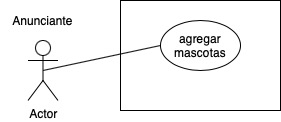

[`Backend Fundamentals`](../../README.md) > [`Sesión 01`](../README.md) > `Ejemplo 3`

# Ejemplo 3: Casos de Uso

Los diagramas de caso de uso consisten en 4 objetos.

- Actor
- Caso de uso
- Sistema
- Paquete

Los objetos se explican con más detalle a continuación.

### Actor

El actor en un diagrama de caso de uso de es cualquier entidad que desempeñe un papel en un sistema determinado. Puede ser una persona, una organización o un sistema externo y normalmente se dibuja como el esqueleto que se muestra a continuación.

### Caso de uso

Un caso de uso representa una función o una acción dentro del sistema. Está dibujado como un óvalo y nombrado con la función.

### Sistema

El sistema se utiliza para definir el alcance del caso de uso y se dibuja como un rectángulo. Este es un elemento opcional pero útil cuando se visualizan sistemas grandes. Por ejemplo, puede crear todos los casos de uso y luego utilizar el objeto del sistema para definir el alcance que abarca su proyecto. O incluso puedes usarlo para mostrar las diferentes áreas cubiertas en los diferentes lanzamientos.

### Paquete

El paquete es otro elemento opcional que es extremadamente útil en diagramas complejos. Los paquetes se utilizan para agrupar los casos de uso. Se dibujan como la imagen que se muestra a continuación.

## Dibujando Casos de Uso

Existen muchas herramientas que nos permiten dibujar esta clase de diagramas, para este modulo vamos a utilizar [`draw.io`](draw.io) que tiene un paquete especifico para dibujar diagramas de caso de uso.

Vamos a traducir nuestra historia de usuario 

*Como anunciante de adoptPet, quiero agregar nuevas mascotas en adopción, para poder buscar hogar a mas animalitos*

a un caso de uso que quedaría de la siguiente forma:

[`Atrás: Sesión 03`](../README.md) | [`Siguiente: Reto-04`](../Reto-04)

