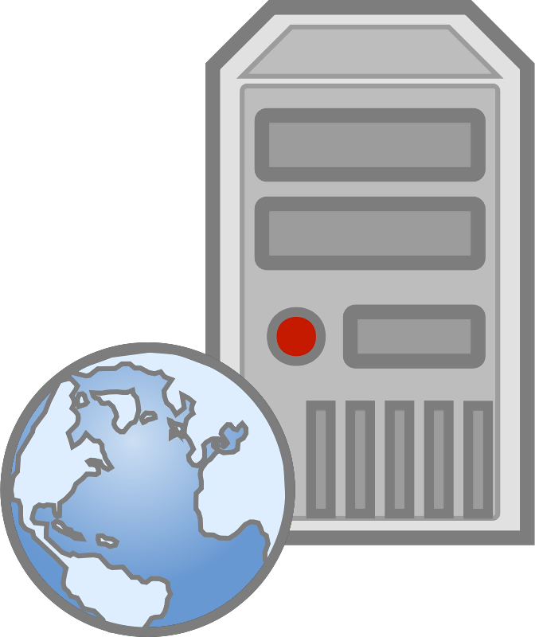
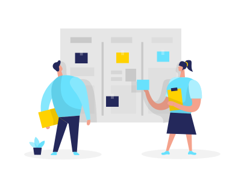

# Sesión 01 - Introducción a Backend 🕹

🎯 **Objetivo:**

- Gestionar usuarios y permisos de archivos, cómo conectarse, utilizar un servidor remoto por medio de ssh
- Enviar archivos remotamente con SCP.

# ¿Qué es un Backend?

Hasta ahora en el curso se había estado trabajando unicamente con la vista de las aplicaciones web, es decir, con la interfaz a la que los usuarios y usuarias tienen acceso y mediante la cual interactua con nuestra aplicación. A este trabajo se le conoce como Frontend. 

El Backend es la parte del desarrollo web que se encarga de que toda la lógica de una página web  funcione. Se trata del conjunto de acciones que pasan en una web pero que no vemos. Es la parte que se conecta con la base de datos y el servidor que utiliza dicho sitio web, por eso decimos que el backend corre del lado del servidor.

Backend es la capa de acceso a los datos, que no es directamente accesible por los usuarios, además contiene la lógica de la aplicación que maneja dichos datos. 

El Backend está compuesto por 3 partes fundamentales:

- **Servidor**
- **Base de Datos**
- **Middleware**

## 👾 Servidor web

Un servidor web es un conjunto de software y hardware que responden las peticiones que los clientes hacen sobre *World Wide Web*.

Para responder a las peticiones, los servidores utilizan distintos protocolos de transferencia de datos por una red, siendo los principales:

- HTTP/HTTPS
- SMTP 
- FTP

Su propósito principal es permitir el acceso al contenido de los sitios web que requieren lxs usuarixs, para esto, el servidor almacena, procesa y envía las paginas web.

## ¿Cómo funciona un servidor web? 🤔

El hardware del servidor está conectado a la internet y permite el intercambio de información con otros clientes también conectados a la red. Este es una computadora que almacena el contenido del sitio web tales como los archivos HTML, JavaScript, CSS, imagenes, etc, es decir, es un **host**.

Mientras que el software controla el acceso que tienen lxs usuarixs a los archivos del servidor. Todo esto utilizando un modelo cliente servidor. Se accede a este mediante la url (Uniform Resource Locator) del sitio, que sirve como el localizador del sitio y asegura que el contenido será entregado a quienes que lo solicitaron.

Todo este proceso se hace utilizando el modelo **cliente/servidor**.

## Proceso

Cuando entramos al navegador y colocamos la dirección de nuestro sitio web favorito, el navegador hace el siguiente proceso para encontrar la página que le pedimos:

1. Con la url, identifica la dirección IP del servidor en el que se *hostea* el sitio que le pedimos
1. Hace una solicitud de los archivos necesarios con el protocolo HTTP 
1. El servidor acepta la petición, busca los archivos y los envía como respuesta

### 🔐 Arquitectura Cliente-servidor

- [`Ejemplo 01: Arquitectura cliente-servidor`](Ejemplo-01/)
- [`Reto 01: Códigos de respuesta`](Reto-01/#reto-1)

### Peticiones a un servidor

- [`Ejemplo 02: Peticiones en Insomnia`](Ejemplo-02/)
- [`Reto 02: Uso de Postman o Insomnia`](Reto-02/#reto-2)

## 📜 Requerimientos de un proyecto

 

Los requerimientos nos dicen como desarrolladorxs que es lo que tenemos que tomar en cuenta a la hora de crear una aplicación o programa. Son las especificaciones que nos proporciona el cliente sobre que espera del software que vamos a desarrollar.

Describen a muy alto nivel las especificaciones y funcionalidades del sistema. 

Por ejemplo nosotros vamos a desarrollar un proyecto llamado AdoptPet, que será una aplicación web que permita a la gente adoptar mascotas y poner mascotas en adopción, a grandes rasgos los requerimientos son los siguientes:

- Publicar anuncios de mascotas en adopción
- Visualizar las mascotas que están en adopción
- Permitir a los usuarios interesados en adoptar registrarse y poder enviar solicitudes de adopción
- Permitir a los cuidadores evaluar solicitudes y confirmar una adopción

### Historias de usuario

Para describir los requerimientos de un sistema a menudo se usan historias de usuarix que son **descripciones cortas** y **simples** de una funcionalidad contada desde la perspectiva de la persona que la desea (usuarix o clientx del sistema). 

Estas historias tienen una **estructura simple**

*"Como **[rol de usuario]** quiero **[objetivo]** para **[beneficio]**"*

Y son utilizadas por varias metodologías para poder comprender mejor los requerimientos y alinearlos con el negocio.

***Ejemplo:***

- *Como usuario de adoptaPet, quiero ver a todas las mascotas que hay en adopción para poder elegir la que más me guste.*

- *Como anunciante de adoptPet, quiero agregar nuevas mascotas en adopción, para poder buscar hogar a mas animalitos*

Posteriormente estas historias se traducen a funcionalidades de nuestro sistema.

<!-- - [`Ejemplo 02: AdoptaPet - Iniciando un nuevo proyecto`](Ejemplo-02/) -->
- [`Reto 03: historias de usuario`](Reto-03/#reto-3)

### Casos de Uso
 

El diagrama de caso de uso es un tipo de diagrama de comportamiento y se usa frecuentemente para analizar varios sistemas. Permiten visualizar los diferentes tipos de roles en un sistema y cómo esos roles interactúan con el sistema. Estos nos ayudarán a:

- Identificarlas funciones y la forma en que los roles interactúan con ellas.
- Para una visión de alto nivel del sistema.
- Identificar los factores internos y externos que intervienen en el sistema

[`Ejemplo 03: Casos de uso`](Ejemplo-03/)

[`Reto 04: Casos de uso `](Reto-04/#reto-3)

<!-- ### Modelo Vista Controlador

- [`Ejemplo 02: Modelo Vista Controlador`](Ejemplo-03/)
- [`Reto 02: Clases en javascript `](Reto-03/#reto-3) -->

