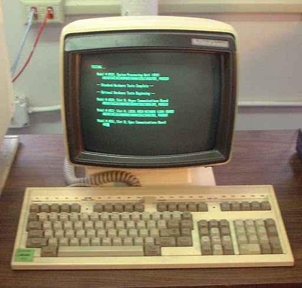
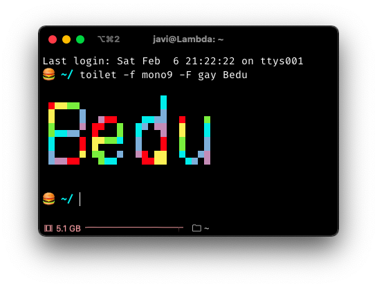
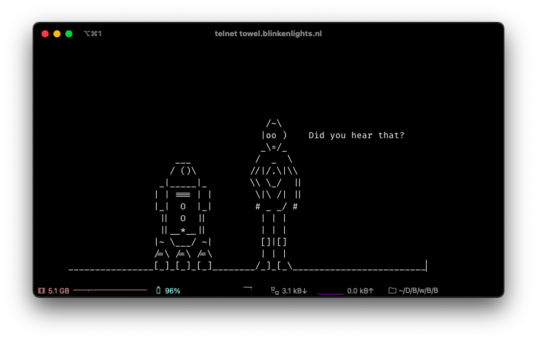

# Sesión 01 - Consola 🧑‍💻

# 🎯 Objetivos Generales:

- Utilizar la terminal, sus principales ventajas y comandos.
- Editar archivos e instalar paquetes en el sistema operativo por medio de la consola.

--- 

# 🤖 La consola 



Las interfaces gráficas (GUI) de los programas nos permiten utilizarlos interactuando con ventanas, botones, iconos, etc. Sin embargo, esta forma de interacción con la computadora es relativamente nueva. En los primeros días los ordenadores no tenían esas bonitas interfaces que estamos tan acostumbradxs a usar y si nosotrxs queríamos darle una instrucciones a la computadora, esto se hacia mediante la linea de comando. 

La consola o terminal es una interfaz que permite acceder a la linea de comando de nuestra computadora. Es decir, es una programa mediante el cual podemos escribir instrucciones para que la computadora las ejecute y, si es el caso, muestre los resultados o mensajes.

## Pero ... ¿Por qué usar la linea de comando? 🤨

Las computadoras fueron creadas para liberarnos del trabajo manual. Pero muchas veces hacemos tareas que terminan siendo muy tediosas moviendo el mouse a un lugar y dando click y luego a otro y de nuevo click y otro y repetir lo mismo de nuevo ... 

Seguro en ese momento has pensado que la computadora debería ser capaz de hacer esas tareas por ti, y así es. La consola nos permite usar la computadora de forma automatizada sin el uso de GUI. 

Las ventajas de la consola son: 

- Es flexible 🧩
- Permite automatizar procesos ⚙️
- Es mas rápida que las GUI ⚡️
- Tenemos un historial de los comandos que ejecutamos 💾
- Nos vemos cool 😎

## ¿Qué podemos hacer desde la consola? ... Todo 

### 🗃 File System

- [`Ejemplo 01: Navegación (File system)`](Ejemplo-01/#navegación-file-system)
- [`Reto 01: Creación de carpetas`](Reto-01/#reto-1)

---

### 📝 Editar y manipular de archivos

- [`Ejemplo 02: Editando Archivos`](Ejemplo-02/#editando-archivos)
- [`Reto 02: Ediciones de archivos`](Reto-02/#reto-2)

---

### 📀 Instalar de paquetes

- [`Ejemplo 03: Instalando paquetes`](Ejemplo-03/#instalando-paquetes)
- [`Reto 03: Instalación de paquetes`](Reto-03/#reto-3)

---

### 🎨 ASCII Art

Primero se instala el paquete `toilet`.

``` 
sudo apt-get install toilet 			#Linux
brew install toilet 				#Mac
```

Se ejecuta el siguiente comando:

``` 
toilet -f mono9 -F gay Bedu
```




---

### 📼 Ver películas 

Ejecuta el comando:

```
telnet towel.blinkenlights.nl
```



>💡**Nota:**
>
> Para salir pulsa `Ctrl+]` 

---


# 🛡 Postwork

Recuerda que todo lo trabajado en tu prework, así como en el work, puede ser aplicado a tu proyecto personal; Para lo cual, toma las siguientes consideraciones ...[`leer más`](Postwork/#postwork)

