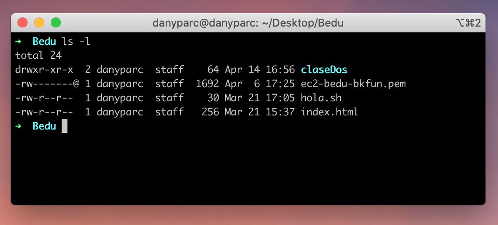

[`Backend Fundamentals`](../../README.md) > [`Sesión 02: Administración de servidores`](../README.md/#sesión-2---administración-de-servidores) > `Ejemplo 1`

# Ejemplo 1: Usuarios y permisos

**Objetivos:**

- Conocer los distintos tipos de usuarios de un sistema operativo UNIX.
- Entender los diferentes tipos de permisos de un archivo y cómo modificarlos.

**Requerimientos**

Tener **instalado** sistema operativo **Linux** o **MacOS**.

## Desarrollo

En UNIX contamos con los siguientes tipos de **usuarios**:

Tipo | Explicación
-- | --
owner (propietario) | Campo B0
group (grupo) | 	Todos los usuarios que son miembros del mismo grupo.
others (otros) | Todos los demás usuarios del sistema que no son propietarios ni miembros del grupo.

Cada uno de estos usuarios tiene un tipo de permiso específico sobre cada archivo.

Los permisos son:

- `r`: Lectura (**r**ead)
- `w`: Escritura (**w**rite)
- `x`: Ejecución (e**x**ecute)

## Iniciando sesión como usuario root

Para cambiar los privilegios y propietarios de nuestros archivos necesitamos los permisos suficientes.

Para esto necesitamos **autentificarnos cómo usuarios root**

Para iniciar sesión en **ubuntu con usuario root ingresaremos el siguiente comando:**

`su -i` 

Seguido de nuestro **password** si éste es requerido.

**Cuidado:** Al estar autenticados como usuarios root contaremos con todos los privilegios, así que podremos hacer CUALQUIER modificación al sistema operativo.

>💡 **Nota:**
>
>Podemos salir de la sesión escribiendo la palabra `exit` y dando enter.

## Listando privilegios en los archivos

Cada archivo tiene un **tipo de acceso para cada usuario.**

Entraremos a nuestra **carpeta bedu** de los ejemplos anteriores y ejecutaremos el comando:

`ls -l`



**Ejemplo**

Utilizaremos los valores del archivo `hola.sh`.

- **-rw-r--r--** En la primera columna obtendremos una representación de los bits de permisos cuyo primer caracter nos indica el **tipo de archivo puede ser folder** `d`, **archivo regular** `-`, o **symbolic link** `l`, los siguientes 3 caracteres serán los **permisos que el propietario tiene sobre ese archivo**, luego los permisos del grupo y al final los permisos globales.

- **1** – Una cantidad de **enlaces fijos**(hard links). Básicamente, un enlace fijo es un nombre adicional para un archivo existente.
- **danyparc staff** – Muestra el **propietario** y el **propietario del grupo** del archivo.

- **30** – Esto muestra el **tamaño** del archivo.

- **Mar 21 27:05** – Muestra la **fecha** de la última modificación.

- **hola.sh** – Proporciona el **nombre** del archivo/carpeta.

### Comando `chown`

El comando `chown` nos permite cambiar al propietario de un archivo

**Sintaxis:**

`chown [owner/group owner] [nombre del archivo]`

Si tenemos un archivo **«demo.txt»** y queremos que el propietario del archivo sea **«juan»** y que el propietario del grupo sea **«clientes»**, usaríamos este comando:

```
chown juan:clientes demo.txt
```

> 💡 **Nota:**
>
> Para listar los grupos puedes usar el comando `groups` o para ver los grupos a los que un usuario pertenece puedes usar `groups <nombre_de_usuario>`

## Cambiando privilegios de un archivo

### Comando `chmod`

El comando `chmod` nos permite cambiar los privilegios a los archivos.

Cada tipo de permiso tiene su propio **número**:

- **r** (read) – 4
- **w** (write) – 2
- **x** (execute) – 1

estos valores numéricos se suman para **asignar permisos** a un tipo de usuario.

Entonces, para cambiar los permisos de **hola.sh** a estos:

**-rwxr–rw- 1 danyparc staff 0 Mar 21 27:05 hola.sh**

Ejecutaremos este comando:

```bash
chmod 746 hola.sh
```

Donde **7** es la **suma de los valores numéricos** de los permisos para el propietario, **4** para el **grupo** y **6** para el **público en general**.

Así que tendríamos un archivo dónde el propietario tiene todos los permisos, el grupo solamente puede leer y otros únicamente pueden leer y escribir.

Si quisieramos **cambiar** los permisos de un **folder** junto con todos los archivos que contiene, podemos utilizar la opción `-R` para aplicar el comando de manera recursiva.

```bash
chmod -R 744 claseDos
```

-------

[`Atrás: Sesión 02`](https://github.com/beduExpert/A2-Backend-Fundamentals-2020/tree/master/Sesion-02) | [`Siguiente: Reto 01`](../Reto-01)
