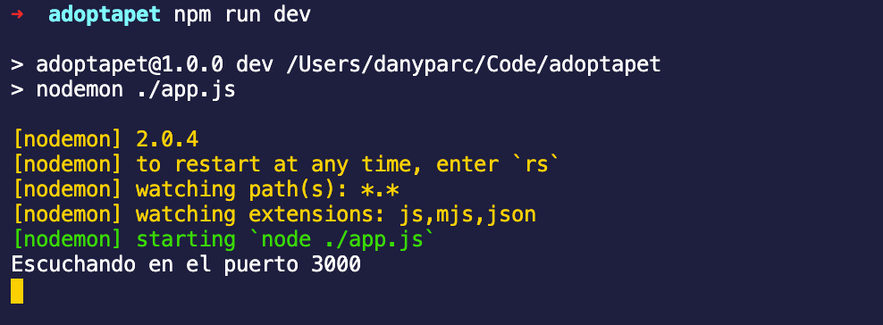

# Ejemplo 2: SSH

**Objetivo**

Conocer SSH y conectarnos a un servidor remoto.

**Requisitos**

Lx expertx debe proveer la dirección del servidor y el archivo de la llave con la cual nos conectaremos.

## Desarrollo

1. Verifica que **ssh** esté **instalado** en tu sistema

    Dentro de la terminal ejecutaremos el comando `man ssh`

    Si está instalado veremos algo cómo esto:

    

2. Cambiar los permisos de nuestra llave privada (archivo `.pem`)

Ejecutaremos el comando `chmod`

`sudo chmod 600 [ruta del certificado]`

> 💡 **Recomendación**
>
> Como buena práctica se recomienda guardar el certificado (.pem) en una carpeta oculta con nombre `.ssh` y **NUNCA** subirlo a un repositorio público o compartirlo por un medio inseguro de comunicación.


3. Conectarnos con ssh por medio de la dirección y usuarix de nuestro servidor remoto

**Sintaxis:**

`ssh -i [ruta archivo .pem (key)] [usuario]@[dirección]`

**Ejemplo:**

```bash
ssh -i ./ec2-bedu-bkfun.pem ubuntu@ec2-52-43-163-239.us-west-2.compute.amazonaws.com
```

Si todo salió bien podremos ver algo como esto


**Lo cual significa que hemos iniciado sesión dentro de una máquina remota.**

-------

[`Atrás: Reto 01`](../Reto-01) | [`Siguiente: Reto-02`](../Reto-02)
