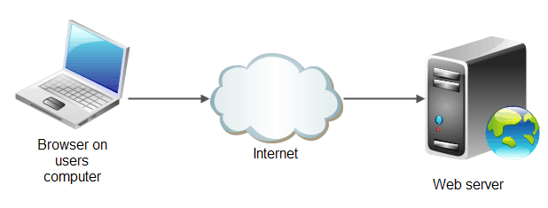

# Sesión 2 - Administración de servidores 🌐

# 🎯  Objetivo:

- Gestionar usuarios y permisos de archivos, cómo conectarse, utilizar un servidor remoto por medio de ssh y enviar archivos remotamente con SCP.

# 👾 Servidor web

Un servidor web es un conjunto de software y hardware que responden las peticiones que lxs clientxs hacen sobre *World Wide Web*.

Para responder a las peticiones, los servidores utilizan distintos protocolos de transferencia de datos por una red, siendo los principales:

- HTTP/HTTPS
- SMTP 
- FTP

Su propósito principal es permitir el acceso al contenido de los sitios web que requieren lxs usuarixs, para esto, el servidor almacena, procesa y envía las paginas web.

## ¿Cómo funciona un servidor web? 🤔

El hardware del servidor está conectado a la internet y permite el intercambio de información con otrxs clientxs también conectados a la red. Este es una computadora que almacena el contenido del sitio web tales como los archivos HTML, javascript, CSS, imagenes, etc, es decir, es un **host**.

Mientras que el software controla el acceso que tienen lxs usuarixs a los archivos del servidor. Todo esto utilizando un modelo cliente servidor. Se accede a este mediante la url (Uniform Resource Locator) del sitio, que sirve como el localizador del sitio y asegura que el contenido será entregado a lxs usuarixs que lo solicitaron.

Todo este proceso se hace utilizando el modelo **clientx/servidor**.

## Conceptos clave para utilizar un servidor

### 🧑‍💻 Usuarios y permisos

- [`Ejemplo 1: Usuarios y permisos`](Ejemplo-01/#ejemplo-1-usuarios-y-permisos)
- [`Reto 01: Permisos actuales de tus archivos`](Reto-01/#reto-1)

### 🗝 Establecer conexión con un servidor

- [`Ejemplo 2: SSH`](Ejemplo-02/#ejemplo-2-ssh)
- [`Reto 02: Inicir sesión en una máquina remota`](Reto-02/#reto-2)

### 🕹 Usar servidores remotos

- [`Ejemplo 3: Utilizando el servidor remoto`](Ejemplo-03/#ejemplo-3-utilizando-el-servidor-remoto)
- [`Reto 03: Crea tu propio archivo en el servidor`](Reto-03/#reto-3)

# 🛡 Postwork

**Objetivo:**

- Aprender a utilizar SCP y conocer FTP cómo protocolo para la transferencia de información a un servidor.

Recuerda que todo lo trabajado en tu prework, así como durante la sesión, puede ser aplicado a tu proyecto personal; Para lo cual, toma las siguientes consideraciones...[`leer mas`](Postwork/#postwork-transferencia-de-archivos-a-un-servidor-scp-y-ftp)
