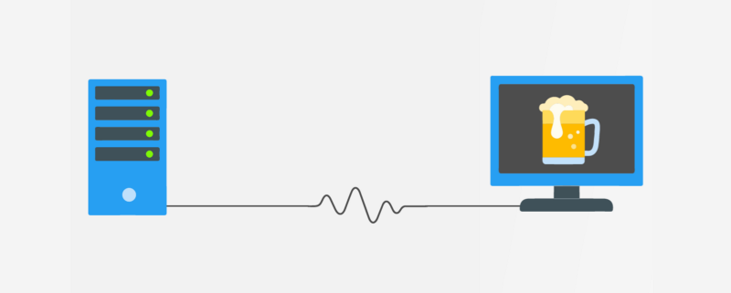

# Sesión 2 - Middleware (API)

 🎯 **Objetivo:**

- Comprender el funcionamiento de un Middleware en el desarrollo backend

## Middleware

Recordemos que los componentes principales del Backend son: **Server**, **Base de Datos** y **Middleware** en esta sesión nos concentraremos en entender cuál es la funcionalidad del **Middleware**.

En esencia, el middleware es la conexión que existe entre el lado del cliente (la interfaz de usuario) y el lado del servidor (el servidor y la base de datos). Pensemos en el middleware como la plomería de una casa que se encarga de llevar todos los recursos (Agua, gas, electricidad, etc.) a las personas que la habitan. 

El middleware debe proveer una interfaz de comunicación que se adapte tanto a las necesidades del cliente como las del servidor por lo que debe ser muy flexible. 

## 🎡 API 

Aunque no lo notemos estamos rodeados de API's 😨, cuando entramos a facebook, cuando mandamos un mensaje en whatsapp (o telegram), cuando googleamos algo, cuando checamos el clima para elegir nuestro outfit, cuando tweeteamos en contra del sistema, cuando pedimos un uber, cuando tenemos un match en tinder, etc. 

En todos esos momentos estamos usando API's sin darnos cuenta. 

### Y a todo esto ¿Qué es una API? 

Una API (Application Programming Interface) es un intermediario que le permite a dos aplicaciones interactuar entre sí.

Es una aplicación que toma las peticiones hechas por lx clientx y le dice al sistema que es lo que tiene que hacer, cuando obtiene una respuesta en se la regresa al usuarix.

### ¿Para que sirve una API?

Alguna vez te has preguntado como puedes comprar algo por internet sin que una persona genere directamente tu orden. Es decir, como es posible que la aplicación de amazon se comunique con mi banco para hacerme un cobro y al mismo tiempo también interactue con un proveedor para que me manden mi pedido.

Toda esta interacción entre aplicaciones, datos y dispositivos de diferentes orígenes y propósitos es posible gracias a un API, es ese motor que está detrás de escenas haciendo todo el trabajo y que la mayoría del tiempo damos por sentado pero que sin él está interacción entre las aplicaciones no sería posible. 

> Ejemplo: un mesero en un restaurante 🍽 

### REST API 

- [`Ejemplo 1`](Ejemplo-01/)
- [`Reto 01`](Reto-01/#reto-1)

### Obteniendo Información 

- [`Ejemplo 2`](Ejemplo-02/)
- [`Reto 02`](Reto-02/#reto-2)

### CRUD

- [`Ejemplo 3`](Ejemplo-03/)
- [`Reto 03`](Reto-03/#reto-3)

