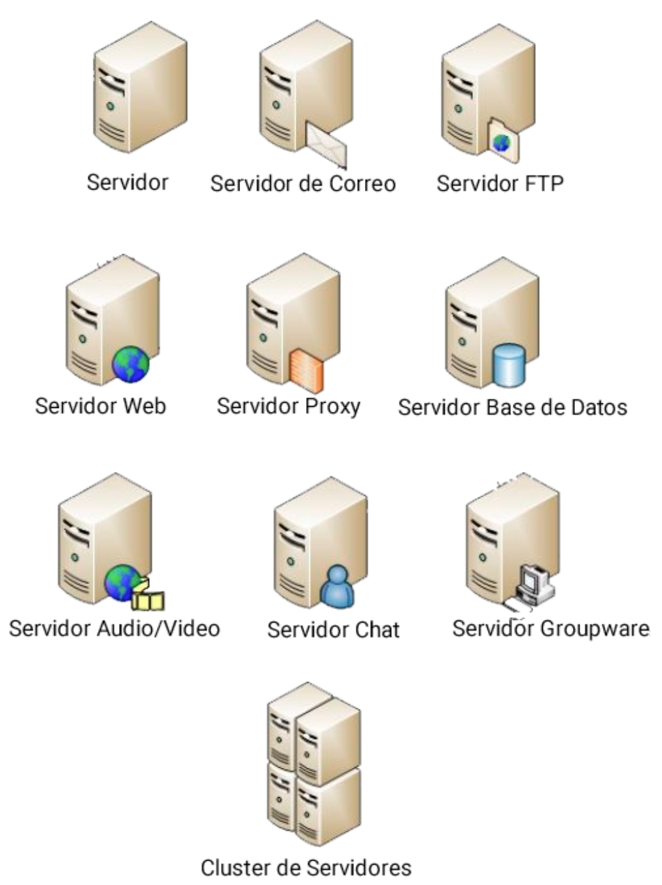

[`Backend Fundamentals`](../../README.md) > [`Sesión 03: Arquitectura de software`](../README.md) > `Ejemplo 1`

# Arquitectura cliente-servidor

**Objetivo:**

- Comprender las diferencias entre un cliente y un servidor web, la manera en la que se comunican y los diferentes tipos de servidores y protocolos más comunes de la web.

**Requerimientos:**

- Navegador web y cuaderno o aplicación para tomar notas.

## Desarrollo

La arquitectura que gobierna la web actualmente es la arquitectura cliente-servidor.

### **Cliente**

El cliente se ocupa de hacer peticiones, recibir respuestas y presentarlas al usuario.  En los primeros días eran ordenadores de uso común, ahora un cliente es cualquier tipo de dispositivo capaz de enviar una petición, esto engloba smartphones y dispositivos inteligentes como bocinas, luces, refrigeradores, relojes, termostatos, etc.

### **Servidor**

Es un sistema diseñado específicamente para satisfacer las demandas de información de los clientes. El servidor recibe las peticiones del cliente, las procesa y responde la información solicitada.

Los servidores suelen realizar tareas complejas y especializadas, comúnmente también hacen peticiones a otros sistemas como a servidores de bases de datos o servicios externos e internos *(micro-servicios)*.

Algunos ejemplos de servidores son:

- Servidores de base de datos.
- Servidores de correo electrónico.
- Servidores de imágenes.
- Servidores WEB.



Tomando esto en cuenta es común dividir las responsabilidades y los equipos de desarrollo en ***Frontend developers*** y ***Backend developers**,* dónde los primeros se encargan de desarrollar el código que se ejecutará en un navegador, y los segundos el código y las configuraciones del lado del servidor.


## Protocolo HTTP

En informática, un protocolo es únicamente una manera en la que acordamos que se comunicará un sistema.  

Haciendo una analogía podemos decir que un protocolo en la vida real sería la serie de reglas del sistema postal de correo. Si hoy quisiéramos enviar una carta por correo necesitaríamos escribir en un sobre el nombre y la dirección del destinatario, esta dirección a su vez contendría su código postal, también necesitaríamos un timbre y los datos del remitente. 

De manera similar, el protocolo base para el funcionamiento de la web es el protocolo HTTP, que significa "Hypertext Transfer Protocol". Este protocolo de petición-respuesta está basado en otros protocolos que funcionan en un nivel más bajo de la red. 


## Peticiones

HTTP define un conjunto de métodos de petición *(request method)* para indicar que acción se desea realizar. Los métodos más importantes son:

### `GET`

Solicita una representación de un recurso específico. Las peticiones que usan el método GET únicamente obtienen datos.

### `POST`

El método **POST** se utiliza para enviar una entidad a un recurso en específico, causando a menudo un cambio en el estado o efectos secundarios en el servidor. También es común que se utilice para crear nuevos registros de recursos en una API.

### `PUT`

El modo **PUT** reemplaza todas las representaciones actuales del recurso de destino con la carga útil de la petición.

### `DELETE`

El método **DELETE** borra un recurso en específico.

Puedes encontrar todos los métodos existentes en el [siguiente enlace:](https://developer.mozilla.org/es/docs/Web/HTTP/Methods)

## Respuestas

Las respuestas además de que pueden estar conformadas opcionalmente por un cuerpo o contenido, son definidas por un código de respuesta. Los códigos de respuesta indican si una petición se ha completado exitosamente o no, y nos brindan información sobre el estado de la respuesta. Las respuestas se dividen en 5 categorías:

1. Informativas (`100`-`199`)
2. Éxito (`200`–`299`),
3. Redirecciones (`300`–`399`),
4. Error del lado del cliente (`400`–`499`),
5. Error del lado del servidor (`500`–`599`).

Algunos de los códigos de respuesta más comunes son:

- `200 OK`
- `302 FOUND`
- `404 NOT FOUND`
- `500 Internal Server Error`

Puedes encontrar más códigos de respuesta en los 

- [HTTP response status codes](https://developer.mozilla.org/en-US/docs/Web/HTTP/Status)
- [HTTP Cats](https://http.cat/)

## Ejemplo 1 - Listando animalitos

Listaremos animales haciendo peticiones a una API pública: 

1. Abriremos una nueva pestaña de nuestro navegador

2. Abrimos el inspector de elementos y nos dirigiremos a la pestaña *Network*

3. Copiamos y pegamos el [siguiente enlace:](https://petstore.swagger.io/v2/pet/findByStatus?status=available)

4. Observar que es lo que sucede

5. En la pestaña de *Network* dar click en la primera petición, analizar los campos del request y de la respuesta.


## Ejemplo 2 - Utilizando un cliente de peticiones

1. Elegiremos e instalaremos alguno de los siguientes clientes de peticiones HTTP/HTTPS
    - [Insomnia Core](https://insomnia.rest/)
    - [Postman](https://www.postman.com/)

2. Añadiremos una nueva mascota haciendo una petición `POST` en el siguiente URL: [https://petstore.swagger.io/v2/pet](https://petstore.swagger.io/v2/pet)


    El cuerpo de la petición estará en formato JSON y será cómo el siguiente:

    ```jsx
    {
      "id": 989898,
      "category": {
        "id": 0,
        "name": "dogs"
      },
      "name": "El Firulais",
      "photoUrls": [
      "https://i.pinimg.com/474x/63/96/a2/6396a292169efeb4651278196a81bb6b.jpg"
      ],
      "tags": [
        {
          "id": 4242,
          "name": "memes"
        }
      ],
      "status": "available"
    }
    ```

Una vez ejecutada la petición, obtendremos una respuesta `200` si todo ha salido bien


-------

[`Atrás: Sesión 03`](https://github.com/beduExpert/A2-Backend-Fundamentals-2020/tree/master/Sesion-03) | [`Siguiente: Reto-01`](../Reto-01)

