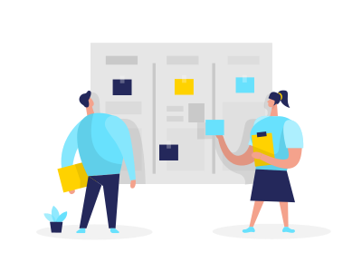

[`Backend Fundamentals`](../../README.md) > [`Sesión 03: Arquitectura de software`](../README.md) > `Ejemplo 2`

# Proyecto - AdoptaPet

# Objetivo

- Presentar un nuevo proyecto y levantar requerimientos para cumplir con la primera etapa de planteamiento de nuestra arquitectura de software.

 

# Requerimientos

- Cuaderno o aplicación para tomar notas y resolver preguntas.

# Desarrollo

- AdoptaPet será una aplicación web que permita a la gente adoptar mascotas y poner mascotas en adopción.

## 1. Conociendo los requerimientos

Los requerimientos a grandes rasgos para este sistema son los siguientes:

- Publicar anuncios de mascotas en adopción
- Visualizar las mascotas que están en adopción
- Permitir a los usuarios interesados en adoptar registrarse y poder enviar solicitudes de adopción
- Permitir a los cuidadores evaluar solicitudes y confirmar una adopción

## 2. Creando User Stories

Las historias de usuario son **descripciones cortas** y **simples** de una funcionalidad contada desde la perspectiva de la persona que la desea (usuario o cliente del sistema). 

Estas historias tienen una **estructura simple**

*"Como **[rol de usuario]** quiero **[objetivo]** para **[beneficio]**"*

Y son utilizadas por varias metodologías para poder comprender mejor los requerimientos y alinearlos con el negocio.

### Ejemplo:

**Como usuario de adoptaPet quiero ver a todas las mascotas que hay en adopción para poder elegir la que más me guste.**

 

[`Atrás: Reto 01`](https://github.com/beduExpert/A2-Backend-Fundamentals-2020/tree/master/Sesion-03/Reto-01) | [`Siguiente: Reto 02`](../Reto-02)
