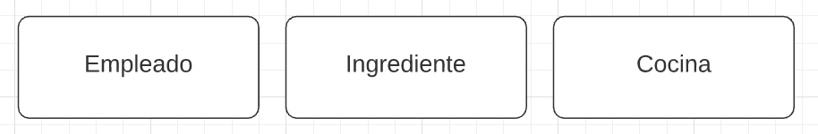
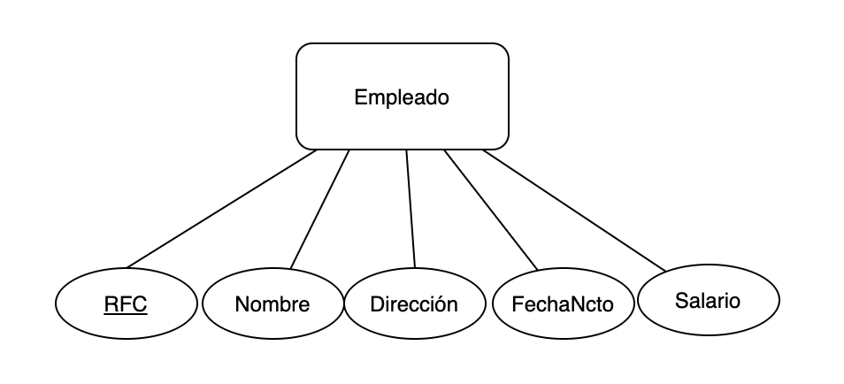
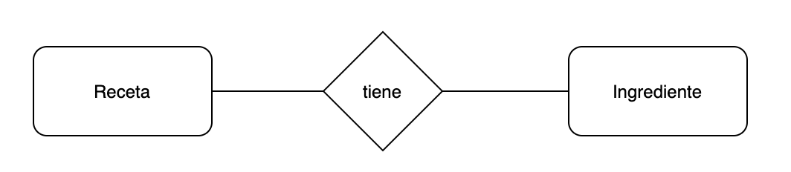
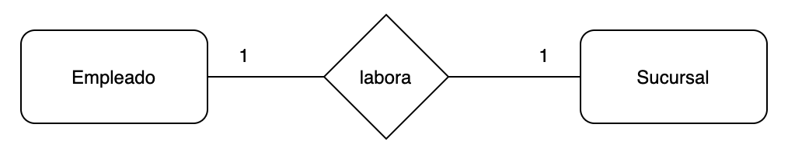
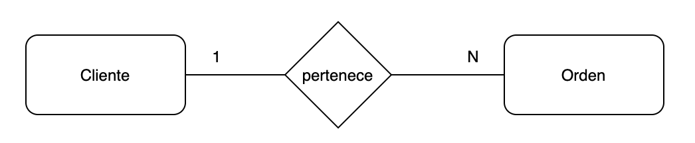
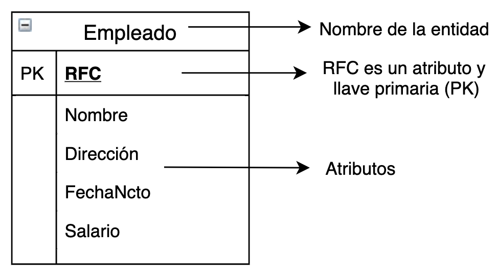
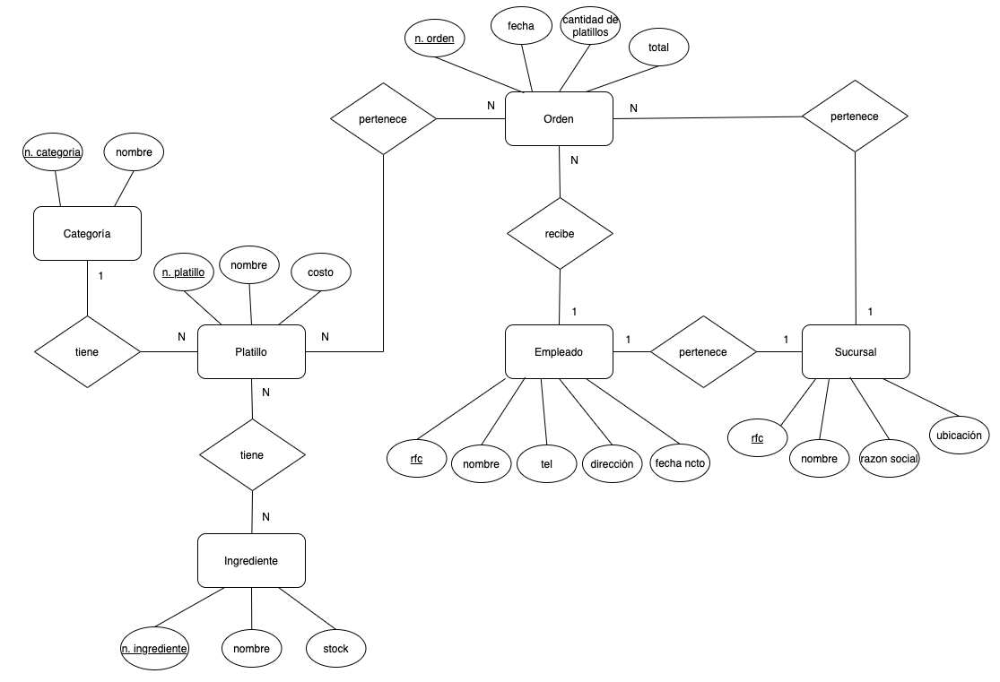
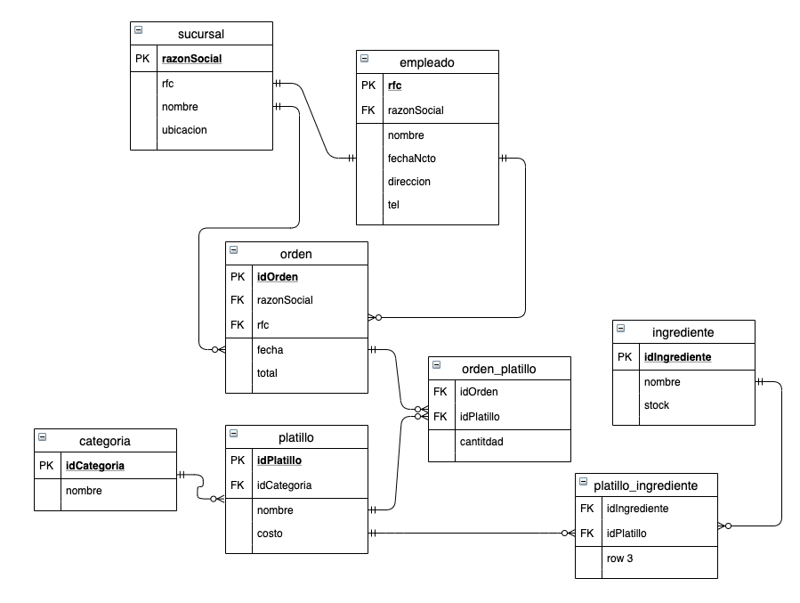

# Ejemplo 2 - Diagramas entidad relación y Modelo Relacional

## Objetivo

Aprender a realizar diagramas entidad relación y utilizarlo como herramienta para modelar bases de datos de alto nivel con representaciones de esquemas conceptuales.

## Requerimientos

Herramienta de software de diagramación, para esta sesión ocuparemos [draw.io](https://www.draw.io)

## Desarrollo

### Modelo ER

El modelo entidad-relación se basa en los conceptos: entidad, tipo de entidad, atributo y relación.

- **Entidad**: Representación de un objeto que puede ser real o abstracto. Ej., de un restaurante se podría crear las entidades: **Empleado**, **menú**, **cocina**, **ingrediente**, **receta**, etc.

    Una entidad se representa en un diagrama conceptual en forma de rectángulos, como los siguientes:

    

- **Tipo de entidad**: Es el conjunto de entidades que comparte los mismos atributos.
- **Atributo**: Es el componente o característica que determina una entidad. Ej., de la entidad **empleado** podemos determinar como atributos: **nombre**, **apellidos**, **teléfono**, **domicilio**, etc.

    Los atributos tienen la forma de óvalo como a continuación:

    

    El concepto de **llave** viene ejemplificado en este diagrama, *RFC* será el atributo con el cual identificaremos univocamente cada entidad y que mediante relaciones podremos acceder a la entidad.

- **Relación**: Es una asociación entre varias entidades. Ej., en un restaurante una receta **tiene** ingredientes.

    En un diagrama podemos observar una relación en forma de rombo:

    

    En este ejemplo podemos hablar de que un ingrediente **pertenece** a una receta y ese mismo ingrediente puede pertenecer a varias recetas, a su vez receta puede tener uno o más ingredientes. Es importante definir la **cardinalidad** en las relaciones ya que especificará el número de entidades con las que se puede asociar otra entidad.

    **1:1**

    

    **1:N o N:1**

    

    **N:N**

    

    ### Modelo Relacional

    El modelo ER facilita las tareas de diseño conceptual de base de datos pero es necesario traducirlo a un esquema que sea compatible con un **Sistema de Gestión de Base de Datos** como lo es MySQL.

    El Modelo relacional es utilizado por la mayoría de los SGDB existentes en el mercado (Oracle, SQL Server, MaríaDB, SQLite).

    En el modelo relacional se utiliza un grupo de **tablas** para representar los datos y las relaciones entre ellos. Cada tabla está compuesta por varias **columnas** que representan los atributos de la entidad y **filas** que serán **registros** o **tuplas**. Estos registros son tienen un identificador único, para diferenciarlos entre si, la **llave primaria**.

    El uso de **llaves** es muy importante ya que se utilizan para definir relaciones. Las tablas se relacionan mediante una ***"relación de llave primaria o de llave foránea"***, dónde:

    - **Llave primaria**: Es un valor en una tabla que identifica de forma exclusiva un registro de la tabla. Existen dos tipos de llaves primarias **simples** cuando están constituidas por una sola columna o **compuestas** cuando se componen de dos o mas columnas.
    - **Llave foránea**: Es una columna o conjunto de columnas en una tabla cuyos valores corresponden a los valores de la llave primaria de otra tabla.

    ### Restricciones de integridad

    La integridad de los datos es la propiedad que asegura que información dada es correcta, al cumplir ciertas aserciones. Las restricciones de integridad son propiedades de la base de datos que se deben satisfacer en cualquier momento entre las cuales están:

    - **Unicidad de llave primaria** establece que toda llave primaria que se elija para una relación no debe tener valores repetidos
    - **Integridad de llave primaria** dispone que los atributos de la llave primaria de una relación no pueden tener valores nulos
    - **Integridad referencial**  está relacionada con el concepto de llave foránea, lo que determina que todos los valores que toma una llave foránea deben ser valores que existen en la llave primaria que referencia
    - **Tratamiento de valores nulos** permite poner valores nulos en los campos no especificados al momento de agregar o generar nuevos registros.
    - **Valores por defecto** es una forma de evitar valores nulos al definir un valor que toman los atributos no definidos en lugar de considerarlos nulos.
    - **Integridad de dominio** define que todos los valores de una columna están tomados del mismo conjunto de datos o son en su defecto valores nulos.

    ### ¿Cómo pasar del Modelo ER al Modelo Relacional?

    Del ejemplo de la entidad "*Empleado"*

    

    Vamos a analizar el siguiente diagrama:

    

    Hemos hablado que el modelo relacional son tablas y columnas, en este ejemplo la entidad *"Empleado"* será el nombre de nuestra tabla y cada atributo será una fila.

    ### Ejemplo 1

    Vamos a poner en práctica todo los conocimientos teóricos adquiridos hasta hora, primero crearemos el diagrama del Modelo ER para un restaurante y luego el Modelo Relacional.

    Ocuparemos [draw.io](https://www.draw.io) que es una herramienta online que nos permite hacer permitir diagramas como los que necesitamos en esta sesión, sólo necesitaremos una cuenta y navegar entre los distintos tipos de diagramas.

    Modelo E/R

    

    Modelo Relacional

    

[`Atrás: Ejemplo 01`](../Ejemplo-01) | [`Siguiente: Reto 01`](../Reto-01)
