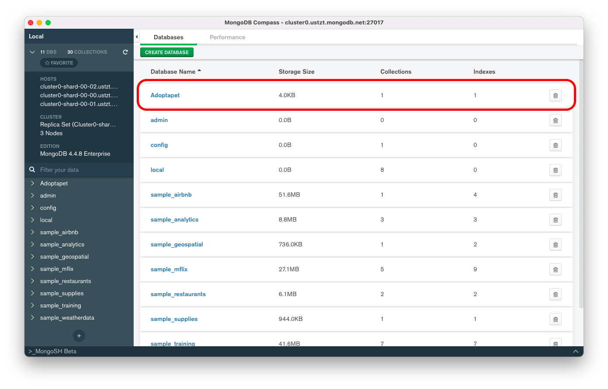

[`Backend Fundamentals`](../../README.md) > [`Sesión 04`](../README.md) > `Ejemplo 2`

## Ejemplo 2: Operaciones con bases de datos

### 1. Objetivos :dart:
- Que el alumno se conecte a un servidor MongoDB
- Que el alumno realice operaciones con bases de datos
- Que el alumno cuente con una base de datos para trabajar

### 2. Requisitos :clipboard:
1. MongoDB Compass instalado
1. Datos de conexión al Servidor MongoDB

### 3. Desarrollo :rocket:

1. En la ventana de __MongoDB Compass__ presionar el botón __CREATE DATABASE__ y crear la base de datos __Adoptapet__ con la colección __Mascotas__, se tiene que definir el nombre de la primera colección para que se pueda crear la base de datos.

   

   Una vez llenados los campos, presionar el botón __CREATE DATABASE__

   Se deberá ver nuestra nueva base de datos en la lista:

   

1. Para hacer uso de la base de datos __Adoptapet__ dar clic en el nombre y se obtendrá la lista de colecciones disponibles:

   

   Se trabajará con Colecciones en el siguiente ejemplo.

[`Anterior`](../README.md) | [`Siguiente`](../Ejemplo-03/Readme.md)      
