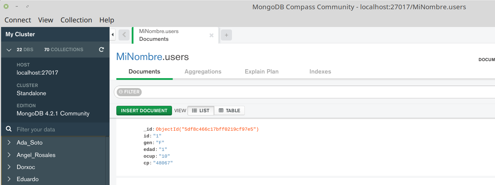
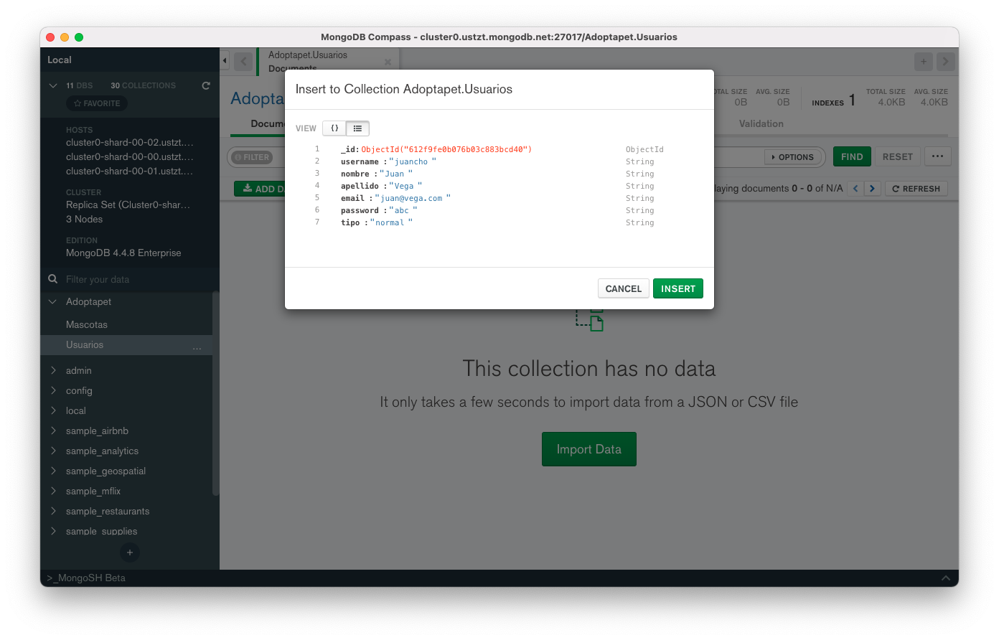
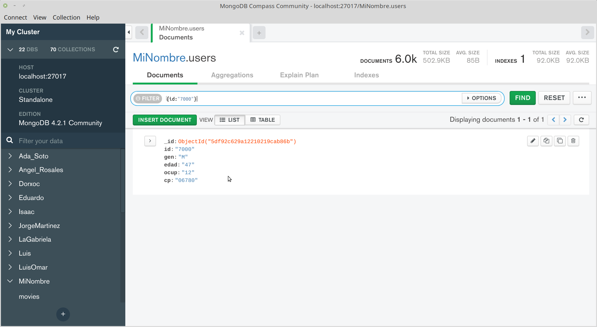
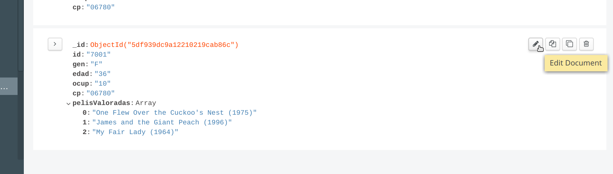

[`Backend Fundamentals`](../../README.md) > [`Sesión 04`](../README.md) > `Ejemplo 4`

## Ejemplo 4: Realizando operaciones con Documentos

### 1. Objetivos :dart:
- Que el alumno agregue __Documentos__ en una __Colección__
- Que el alumno modifique __Documentos__ en una __Colección__
- Que el alumno elimine __Documentos en una Colección__
- Que el alumno comprenda la estructura de documentos de una base de datos __MongoDB__

### 2. Requisitos :clipboard:
1. MongoDB Compass instalado
1. Datos de conexión al Servidor MongoDB
1. Base de datos __Adoptapet__ 

### 3. Desarrollo :rocket:
A continuación se realizaran las operaciones de agregar, modificar y eliminar un documento JSON en una Colección.

1. Para agregar un Documento, dar clic sobre la base de datos __Adoptapet__, luego dar clic sobre la colección __users__ y entonces dar clic sobre el botón __INSERT DOCUMENT__:

   

   Esto abrirá un diálogo que nos permite agregar los campos que conformarán nuestro documento en formato JSON. Por ejemplo:

   ```json
   {
    "username": "juancho",
    "nombre": "Juan",
    "apellido": "Vega",
    "email": "juan@vega.com",
    "password": "abc",
    "tipo": "Normal"
   }
   ```

   
   
   Aunque en el diálogo se puede elegir el tipo de dato correcto para cada caso, todos los campos se importan como cadenas de texto porque así es como se realiza en la importación de datos. Nota que el campo `_id` no es necesario agregarlo, ya que __MongoDB Compass__ lo agrega de forma automática y es la manera en que se crea un identificador único para cada Documento.

   Al final presionar el botón __INSERT__

   

1. Como __MongoDB__ es una base de datos __NoSQL__ se pueden insertar documentos que no tengan la misma estructura y además cada campo puede ser un tipo de dato complejo como un array o un objeto.

   Agregar el siguiente documento JSON de un usuario:
   ```json
   {
    "id": 1,
    "username": "luis",
    "nombre": "Luis",
    "apellido": "Rios",
    "tipo": ["Normal", "Adoptante"]
  }
   ```

   Observa como en `MongoDB` cada campo puede ser un arreglo y cada elemento a su vez también puede ser un arreglo o un objeto y así indefinidamente.

   Luego de presionar el botón __INSERT__ vamos a observar nuestros dos documentos agregados.

1. Para modificar un documento, dar clic sobre el botón __Edit Document__

   

   Después de dar clic en el botón __Edit Document__ el documento cambia a estado editable y se puede modificar el contenido del documento.
   
   Da clic sobre el botón __UPDATE__ para guardar los cambios.


[`Anterior`](../README.md) | [`Siguiente`](../README.md)      
