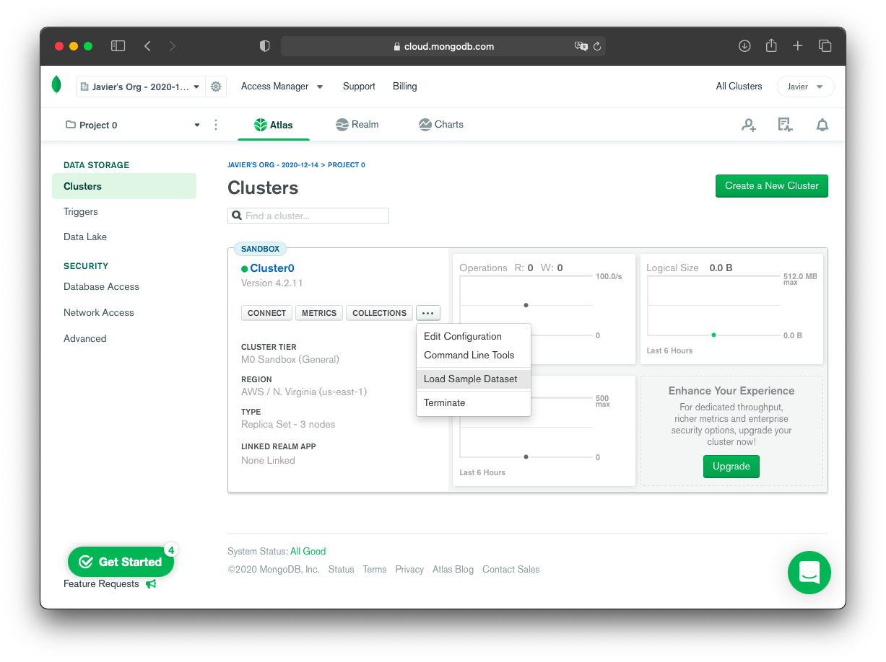

`Backend Fundamentals` > `S5 - Fundamentos de Base de Datos Relacionales(SQL)` 
	
  ### Reto 2

   Cuando el __Cluster__ ya está creado se observa la página como la siguiente:

   

   Abrimos las opciones del cluster dando click en el botón con 3 puntos. Y seleccionamos __Load Sample Dataset__ para que agregue al cluster algunas bases de datos de ejemplo.

   

[`Atrás`](../Ejemplo-03/Readme.md) | [`Siguiente`](../README.md)
