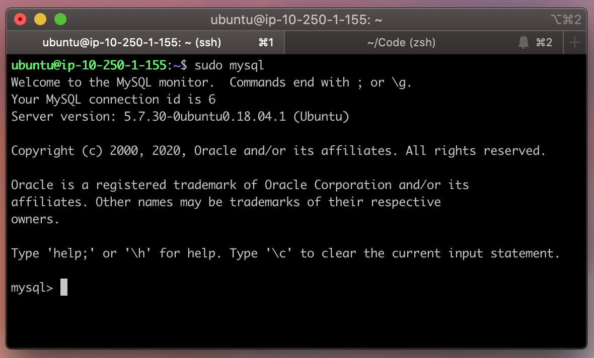

# Ejemplo 1 - Instalando MySQL

## Objetivo

Comprender que es una base de datos relacional e instalar un sevidor de bases de datos relacionales.

## Requerimientos

Contar con almacenamiento suficiente y conexión a internet para instalar MySQL.


# Instalar MySQL server

## Instalación en Ubuntu

Instala el paquete mysql-server y luego ejecuta el script de seguridad incluido.

```bash
sudo apt update
sudo apt install mysql-server
sudo mysql_secure_installation
```

Para asegurar que esté instalado ejecuta

```bash
sudo mysql
```

Y deberás ver una interfaz como esta



## Instalación con Docker

Si tienes [docker](https://docs.docker.com/engine/install/) instalado puedes ejecutar Mysql desde un contenedor instalandolo con el siguiente comando:

```bash
$ docker run -d -p 33060:3306 --name=mysql-db -e MYSQL_ROOT_PASSWORD=secret mysql
```

- **-d**: Detached Mode es la forma en que indicamos que corra en segundo plano.
- **-p** : Puerto, el contenedor corre en el puerto 3306 pero hacemos un *bind* para que lo escuchemos en Host el puerto 33061.
- **–name** : Para no tener que hacer referencia al hash le asignamos un nombre.
- **-e** : Environment le asignamos **la contraseña**.

Entra a Mysql con el siguiente comando:

```bash
docker exec -it mysql-db mysql -p
```

## Instalación en MacOS

### Desde la terminal 

```bash
# se instala el paquete
$ brew install mysql

# se actualizan los servicios disponibles de homebrew
$ brew tap homebrew/services

# Se configura la contraseña para el ususario root de MySQL
$ mysqladmin -u root password 'yourpassword'

# Se inicializa MySQL con la contraseña seleccionada
$ mysql -u root -p
```

### Con un instalador
1. Dirígete al siguiente [link para descargar MySQL server](https://dev.mysql.com/downloads/mysql/)
2. Selecciona tu sistema operativo y descarga el archivo `.dmg`. Para instalar de esta manera tal vez sea necesario crear una cuenta en Oracle.
3. Ejecuta el `.dmg` y sigue los pasos.

[`Atrás: Sesión 05`](../README.md) | [`Siguiente: Ejemplo 02`](../Ejemplo-02)
