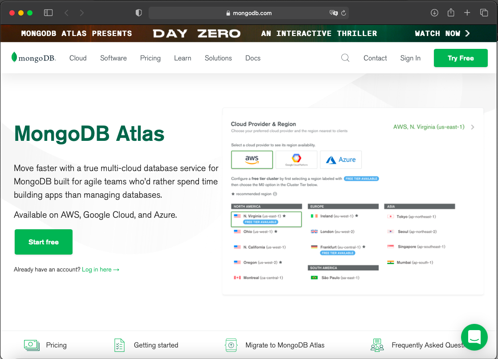
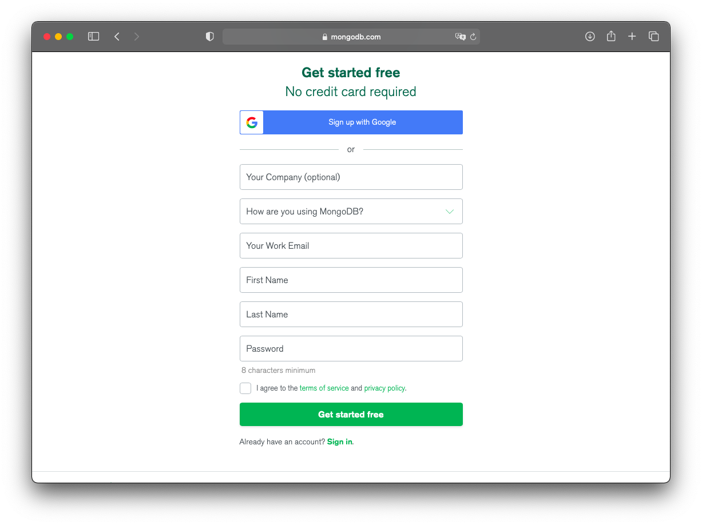
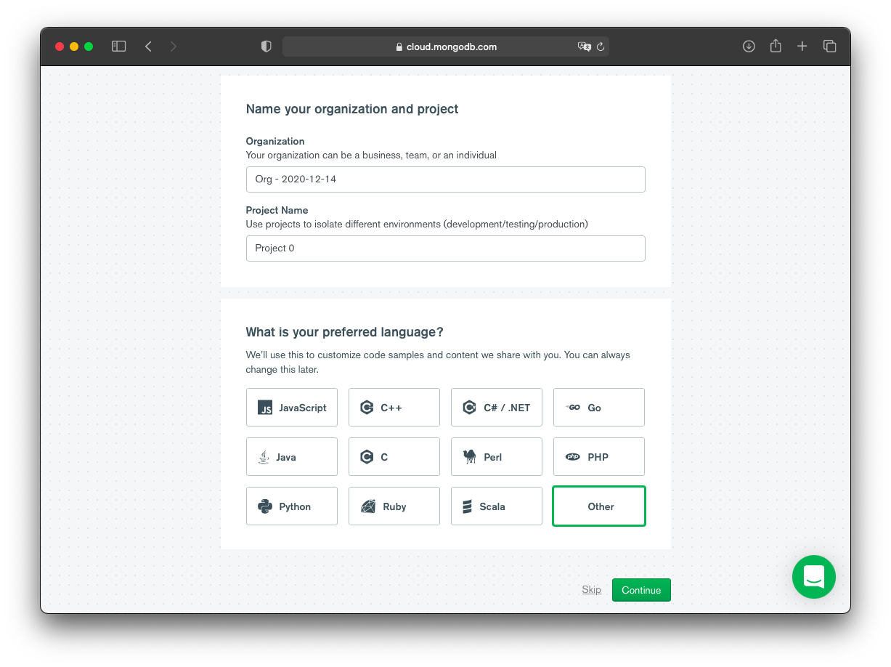
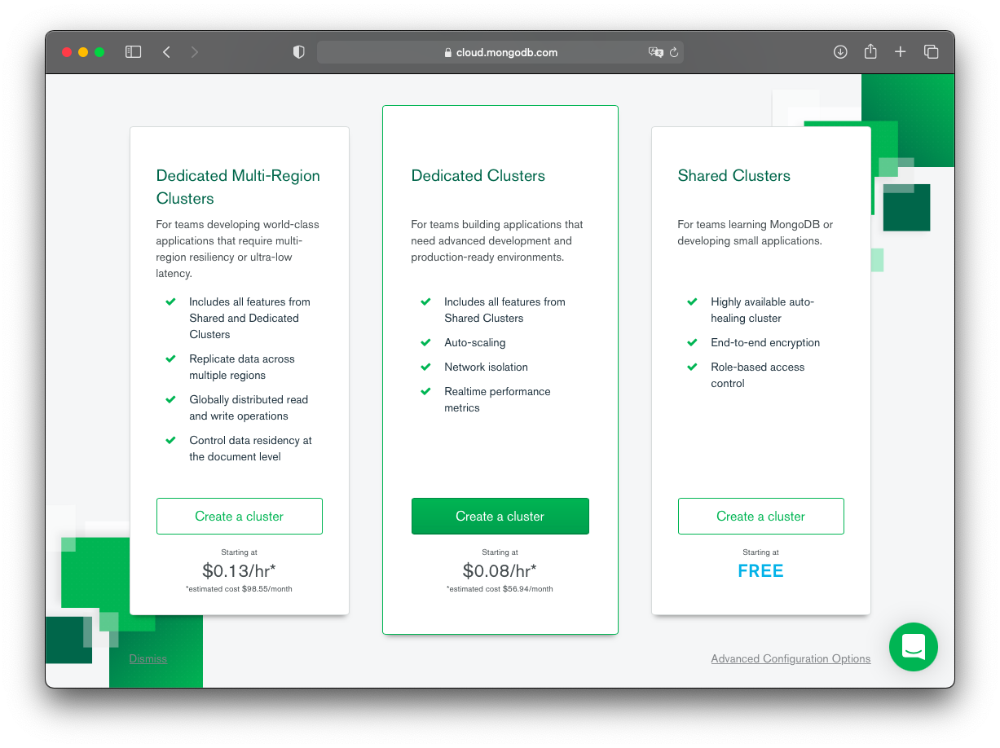
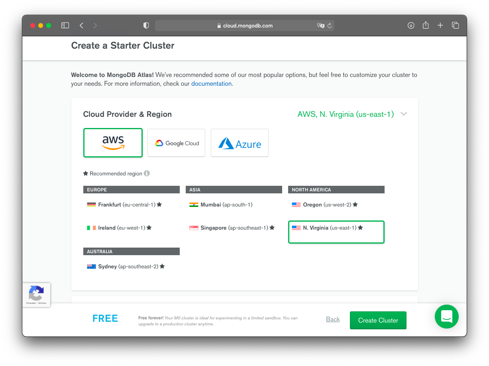
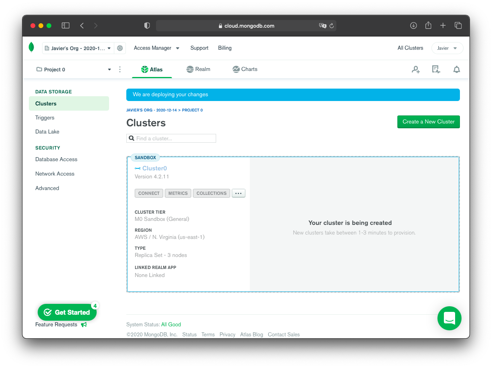
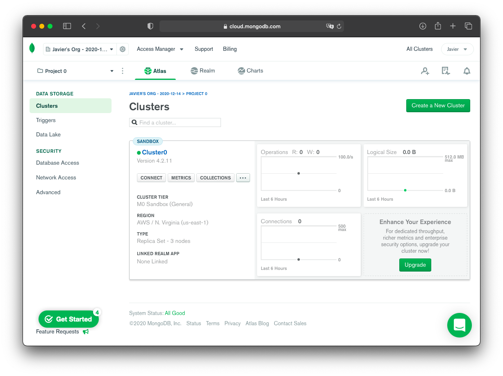
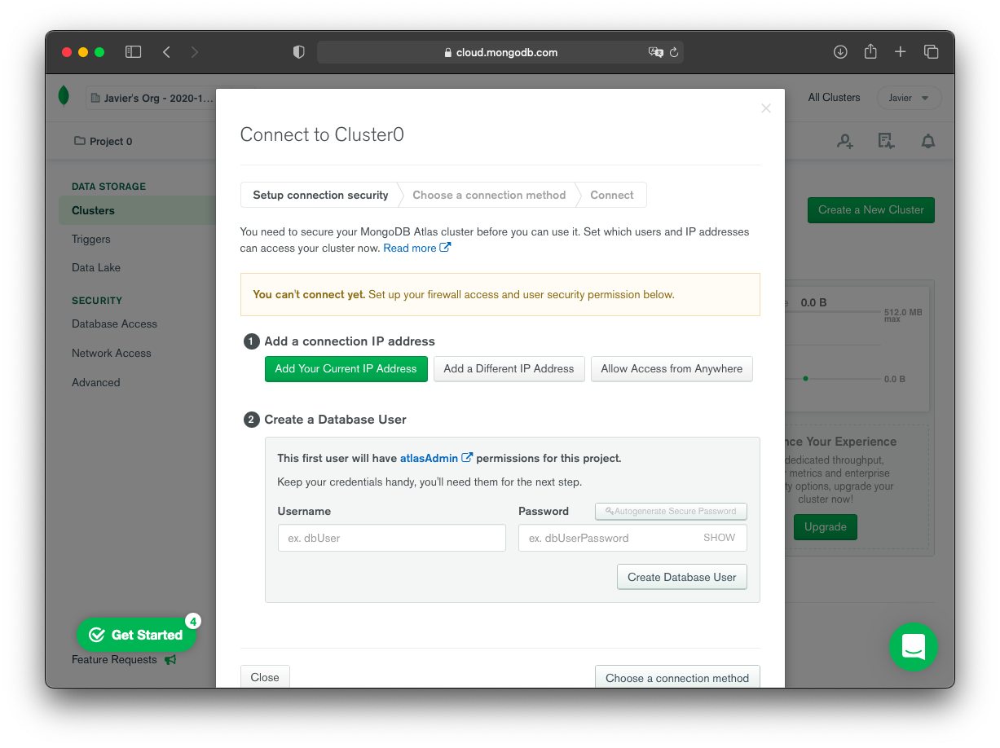
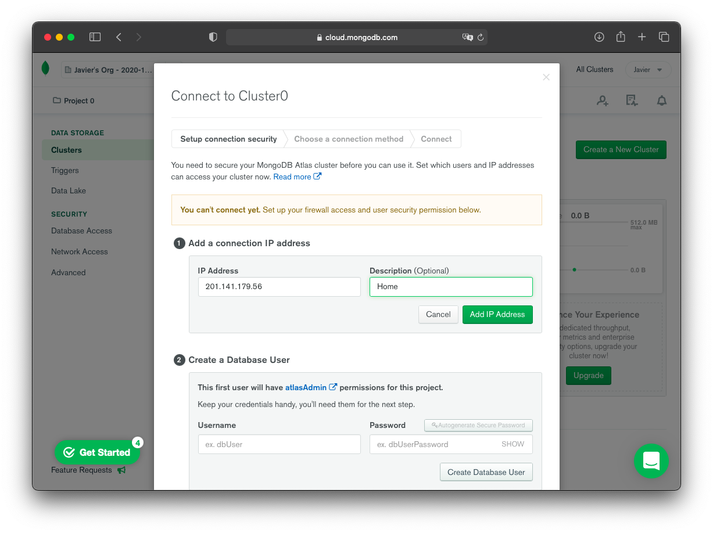
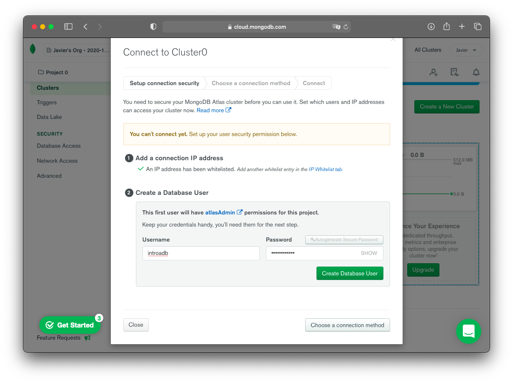

# Ejemplo 1

## Objetivo

Crear un servicio de MongoDB en la nube, configurar la conexión de un host remoto a tráves de una interfaz de MongoDB.

## Requerimientos

- Conexión a internet
- Almacenamiento disponible para la instalación de MongoDB Shell
- Instalación de Nodejs a partir de la versión 12.0

## Desarrollo

### Creando un cluster en MongoDB Atlas

1. Para poder hacer uso de MongoDB en la nube se hará uso del servicio __Atlas__ proveeido por el propio equipo de MongoDB, abrir la siguiente url, llenar los campos del formulario y dar clic en el botón de __Get srtarted free__

   URL: https://www.mongodb.com/cloud/atlas?jmp=docs

   

1. Llenamos el formulario con la información necesaria.

   

1. En la siguiente ventana damos click en la opción __skip__ al final.
    
1. Elegir el tipo de __Cluster__, en donde se seleccionará __Starter Clusters__ que es el que es libre de costo, dar clic en el botón __Create a Cluster__.

   
   Observar que con MongoDB Atlas se crean __Clusters__ y no __Servidores__.

1. Después se tienen que seleccionar las opciones para el __Starter Cluster__ y las opciones por omisión son las correctas (AWM Amazon, N. Virginia, M0 Sandbox, MongoDB 4.0, Cluster 0)

   
   Y presionar en el botón __Create Cluster__, lo que va a crear un __Cluster__ de trabajo, acción que puede demorar unos 5 mins.

   

   Cuando el __Cluster__ ya está creado se observa la página como la siguiente:

   

1. Lo que sigue es iniciar una conexión al cluster de MongoDB en la nube, esto se realiza dando clic en el botón __CONNECT__

  
  
  MongoDB Atlas hace una validación y solicita definir que dirección IP se va a conectar a el servidor y que usuario.

  Así que dá clic en el botón __Add Your Current IP Address__

  
  
  Se sugiere etiquetar la dirección IP, para llevar un registro de a quién corresponde cada IP y más adelante poder eliminar las direcciones que ya no sean necesarias.

  Introduce los datos que desees para ingresar a tu base de datos, por ejemplo:

  - Usuario: beduweb
  - Password: beduweb1234

  
  
  Y presionar en el botón __Create MongoDB User__


<!-- 1. Entra a la siguiente dirección [https://www.mongodb.com/cloud/atlas](https://www.mongodb.com/cloud/atlas/register) y regístrate.
2. Elige la opción de crear un "Shared Cluster" de manera gratuita.
3. Aquí puedes dejar las opciones por defecto y continuar al siguiente paso.

    

    Después serás dirigido a una pantalla dónde nos avisarán cuando el cluster haya sido lanzado.

4. Una vez que esté listo presiona el botón de connect que está debajo del nombre de tu cluster. 

    

    4.1 Añade tu dirección IP para poder hacer peticiones desde tu computadora al cluster. Por seguridad cada que estés en una conexión de internet diferente debes añadir de nuevo tu IP para que sólo tú puedas hacer peticiones al clúster.

    4.2 Crea un usuario y contraseña para administrar atlas.

5. Elige tu método de conexión. -->

### Conexión a clúster con MongoDB Shell

1. Inicia sesión en [https://account.mongodb.com/account/login](https://account.mongodb.com/account/login?nds=true)
2. Seleccionar **Connect** en el dashboard

    

3. Seleccionar **Connect with the mongo shell**

    

4. Click **I have the mongo shell installed** y copiar la url que nos proporcione

    

Donde, 

```bash
mongo "mongodb+srv://cluster0-xmea4.mongodb.net/<*dbname*>" --username <*username*>
```

<*dbname*> : Es el nombre de la base de datos

<*username*> : Nombre de usuario 

5. Reemplaza los valores indicados y ejecuta el comando anterior.


### Conexión a clúster con MongoDB Compass

1. Inicia sesión en [https://account.mongodb.com/account/login](https://account.mongodb.com/account/login?nds=true)

2. Seleccionar **Connect** en el dashboard

    

3. Seleccionar **Connect with MongoDB Compass**

    

4. Click **I have the MongoDB Compass installed** y copiar la url que nos proporcione

                                      

Donde, 

```
mongodb+srv://<username>:<password>@cluster0.kbuns.mongodb.net/<dbname>
```

<*dbname*> : Es el nombre de la base de datos

<*username*> : Nombre de usuario    

<*password*> : Passowrd de usuario
    
5. Crea una nueva conexión desde MongoDB Compass insertando el link copiado en el punto anterior, remplaza los elementos indicados anteriormente. Prueba la conexión.

    

6. De aquí en adelante, utiliza MongoDB Compass para ratificar las configuraciones realizadas desde MongoDB Shell.

[`Atrás: Sesión 06`](../README.md) | [`Siguiente: Reto 02`](../Reto-02)
