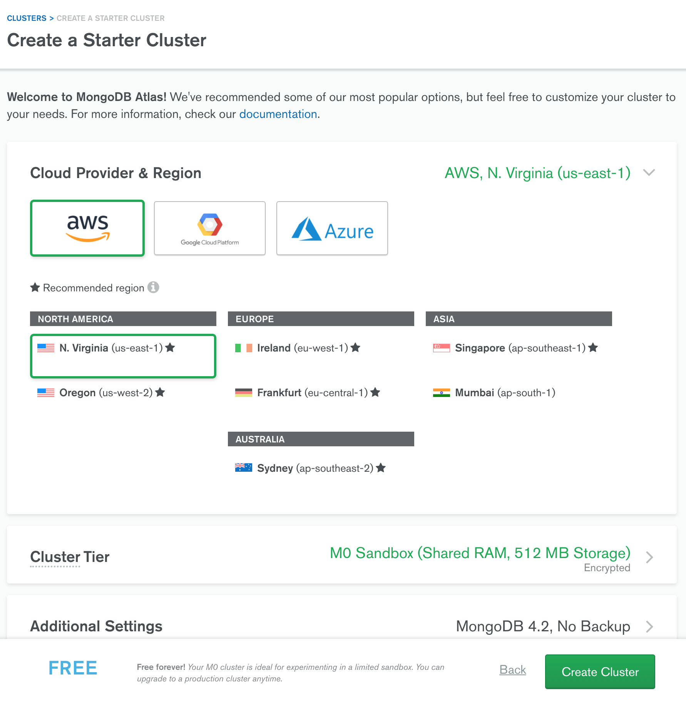
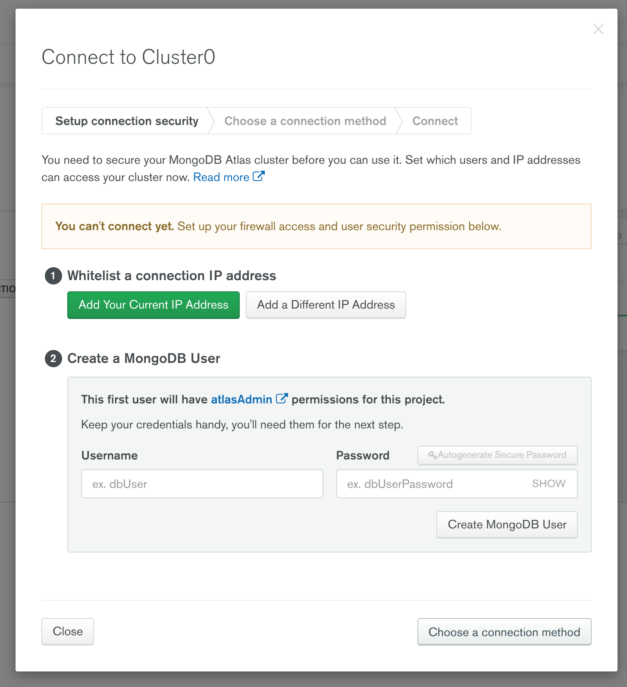
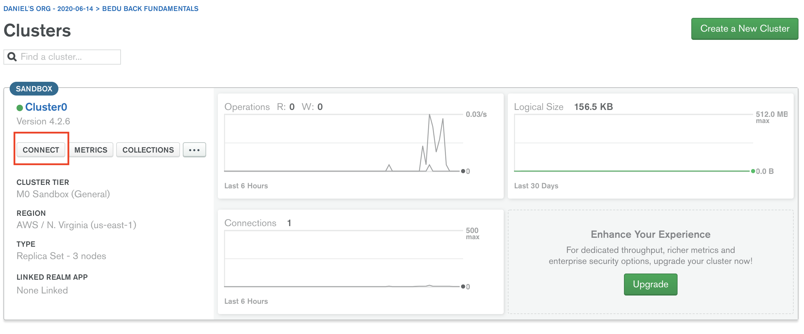
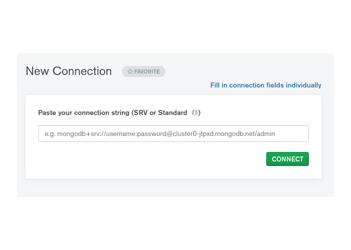

# Ejemplo 1

## Objetivo

Crear un servicio de MongoDB en la nube, configurar la conexión de un host remoto a tráves de una interfaz de MongoDB.

## Requerimientos

- Conexión a internet
- Almacenamiento disponible para la instalación de MongoDB Shell
- Instalación de Nodejs a partir de la versión 12.0

## Desarrollo

### Creando un cluster en MongoDB Atlas

MongoDB atlas es la manera más rápida.

1. Entra a la siguiente dirección [https://www.mongodb.com/cloud/atlas](https://www.mongodb.com/cloud/atlas/register) y regístrate.
2. Elige la opción de crear un "Shared Cluster" de manera gratuita.
3. Aquí puedes dejar las opciones por defecto y continuar al siguiente paso.

    

    Después serás dirigido a una pantalla dónde nos avisarán cuando el cluster haya sido lanzado.

4. Una vez que esté listo presiona el botón de connect que está debajo del nombre de tu cluster. 

    

    4.1 Añade tu dirección IP para poder hacer peticiones desde tu computadora al cluster. Por seguridad cada que estés en una conexión de internet diferente debes añadir de nuevo tu IP para que sólo tú puedas hacer peticiones al clúster.

    4.2 Crea un usuario y contraseña para administrar atlas.

5. Elige tu método de conexión.

### Instalar MongoDB Shell

MongoDB Shell es una interfaz para MongoDB, se puede usar para consultar datos, actualizar datos, así como realizar operaciones administrativas.

**MacOS X**

Instalación con Homebrew:

Prerequisitos: 

- [Nodejs](https://nodejs.org/es/) versión mínima de 12.0.0

1. Instalar Homebrew

    Para seguir los pasos de instalación [Homebrew](https://brew.sh/)

2. Copia y el siguiente comando

    ```bash
    brew tap mongodb/brew
    ```

3. Instalar **mongosh** package:

    ```bash
    brew install mongosh
    ```

**Windows**

1. Ir a [MongoDB Download Center](https://www.mongodb.com/try/download/shell) y descargar el archivo para tu sistema operativo.
2. Extraer los archivos del archivo descargado en la ubicación deseada de tu sistema de archivos.
3. Agregar una variable de entorno para el binario de MongoDB Shell:
    1. Abrir **Panel de Control.**
    2. En **Sistema y Seguridad** dar clic en **Sistema.**
    3. Clic en **Configuración Avanzada del Sistema**. Luego, **Propiedades del Sistema** en la ventana desplegada.
    4. Clic en **Variables de Entorno**.
    5. En *Variables del sistema*, select **Path** and clic en **Edit**. Luego, **Editar variable de entorno** en la ventana desplegada.
    6. Clic **New** y agrega la ruta del archivo binario **mongosh**.
    7. Clic **Ok** para confirmar los cambios. Luego **Ok** de nuevo.
    8. Para verificar que la configuración haya tenido éxito, abre la terminal y ejecuta:

        ```bash
        mongosh --help
        ```

**Linux**

1. Ir a [MongoDB Download Center](https://www.mongodb.com/try/download/shell) y descargar el archivo para tu sistema operativo
2. Extraer los archivos del archivo descargado en la ubicación deseada de tu sistema de archivos
3. Extraer los archivos del archivo descargado

    ```bash
    tar -zxvf path/to/archive
    ```

4. Agregar variable de entorno para el binario de MongoDB Shell:
    - Ejecuta:

         Actualiza **/path/to/mongosh** de acuerdo al directorio de instalación

        ```bash
        sudo cp /path/to/mongosh /usr/local/bin/
        ```

    - Ejecuta

        ```bash
        sudo ln -s  /path/to/mongosh /usr/local/bin/
        ```

### Conexión a clúster con MongoDB Shell

1. Inicia sesión en [https://account.mongodb.com/account/login](https://account.mongodb.com/account/login?nds=true)
2. Seleccionar **Connect** en el dashboard

    

3. Seleccionar **Connect with the mongo shell**

    

4. Click **I have the mongo shell installed** y copiar la url que nos proporcione

    

Donde, 

```bash
mongo "mongodb+srv://cluster0-xmea4.mongodb.net/<*dbname*>" --username <*username*>
```

<*dbname*> : Es el nombre de la base de datos

<*username*> : Nombre de usuario 

5. Reemplaza los valores indicados y ejecuta el comando anterior.


### Instalar MongoDB Compass

MongoDB Compass es un GUI para MongoDB, nos permitirá visualizar y explorar los datos en nuestras colecciones. Instala <b>MongoDB Compass</b> tomando en cuenta las siguientes instrucciones:

Guía de instalación: <b>https://docs.mongodb.com/compass/master/install</b>


### Conexión a clúster con MongoDB Compass

1. Inicia sesión en [https://account.mongodb.com/account/login](https://account.mongodb.com/account/login?nds=true)

2. Seleccionar **Connect** en el dashboard

    

3. Seleccionar **Connect with MongoDB Compass**

    

4. Click **I have the MongoDB Compass installed** y copiar la url que nos proporcione

                                      

Donde, 

```
mongodb+srv://introabd:<password>@cluster0.kbuns.mongodb.net/<dbname>
```

<*dbname*> : Es el nombre de la base de datos

<*username*> : Nombre de usuario    

<*password*> : Passowrd de usuario
    
5. Crea una nueva conexión desde MongoDB Compass insertando el link copiado en el punto anterior, remplaza los elementos indicados anteriormente. Prueba la conexión.

    

6. De aquí en adelante, utiliza MongoDB Compass para ratificar las configuraciones realizadas desde MongoDB Shell.

[`Atrás: Sesión 06`](https://github.com/beduExpert/A2-Backend-Fundamentals-2020/tree/master/Sesion-06) | [`Siguiente: Reto 01`](https://github.com/beduExpert/A2-Backend-Fundamentals-2020/tree/master/Sesion-06/Reto-01)
