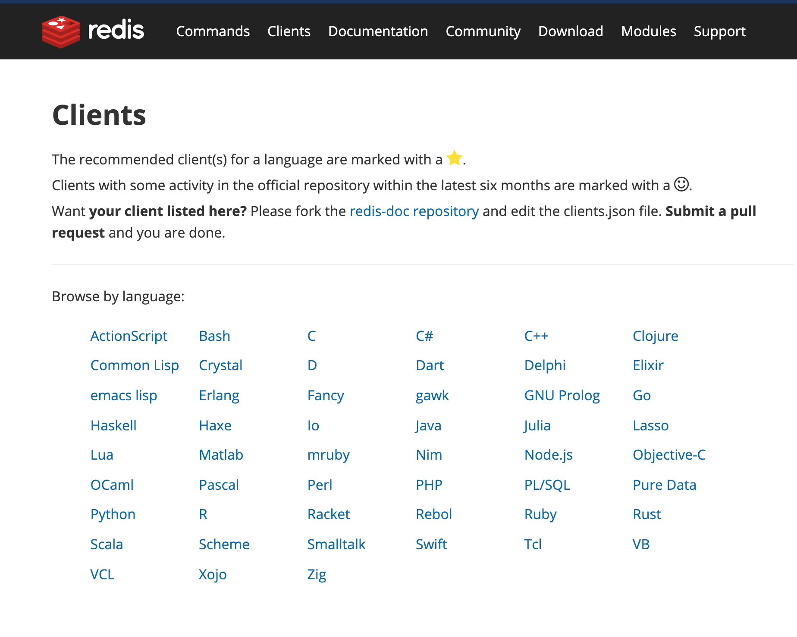

# Prework

## Objetivo

Comprender qué es un ORM y su importancia en el desarrollo.

## Instrucciones

Leer el siguiente artículo y posteriormente contestar el cuestionario adjunto.

## Desarrollo

### ¿Cómo conectar el backend con mi base de datos?

Para abstraer entidades (Modelos) y facilitar el trabajo de los programadores, la comunidad de desarrolladores de NodeJS y demás ecosistemas como Python y Java, han desarrollado herramientas que proveen una manera más eficiente de interactuar con las bases de datos.

Es muy común que cuando quieras comenzar a trabajar con alguna de las bases de datos existentes en tu lenguaje de programación favorito al buscar la manera de hacerlo te encuentres con librerías existentes para trabajar con la base de datos de tu preferencia. 

Estas librerías, también conocidas como clientes las puedes encontrar directamente en el sitio oficial de la BD que elijas, un ejemplo es la lista de clientes para trabajar con [Redis](https://redis.io/clients).

Para trabajar con el patrón MVC es muy recomendable trabajar con librerías que *mapeen* las clases de nuestro lenguaje de programación si estamos trabajando con un lenguaje orientado a objetos, estas librerías son conocidas como ORM ó ODM.

### ¿Qué es un ORM?

El ORM (Object Relational Mapping) es una técnica de programación que permite la relación de los objetos con los datos que ellos mismos representan.

El ORM contiene herramientas que permiten la conversión de objetos para ser almacenados en una base de datos relacional.

Por ejemplo, si queremos trabajar con Node.js y una base de datos SQL podemos utilizar [Sequelize](https://sequelize.org/v5/).

### ¿Qué es un ODM?

Un ODM (Object Document Mapping) es una herramienta para trabajar con objetos en bases de datos orientadas a documentos cómo MongoDB y los datos que estos objetos representan. Para Javascript, el más popular de ellos es [Mongoose](https://mongoosejs.com/).

### ¿Por qué esto es importante?

Si trabajaramos haciendo peticiones directamente al servidor de bases de datos, implicaría realizar mucho código adicional para manejar todas las conversiones de datos a sus representaciones necesarias para ser comunicados por medio de una API. También trabajar con servidores de datos implica hacer muchas validaciones, correr pruebas y considerar la seguridad de la misma. Al utilizar una librería probada y mantenida por la comunidad, podremos ahorrarnos este trabajo y poder utilizar el tiempo restante en crear una aplicación más estable y con características de valor para el usuario final.
