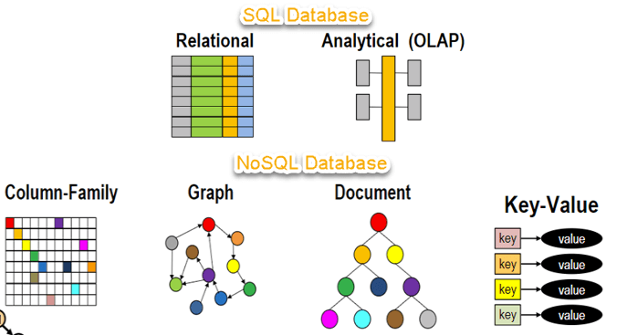

# Sesión 6 - Fundamentos de Base de Datos NoSQL (Mongo)

🎯 **Objetivo:**

- Reconocer características de las bases de datos NoSQL, configurar y utilizar MongoDB.
- Comprender en qué casos es conveniente utilizar esta B.D. y cómo usarla. 

## ⏳ Antes de empezar 

- [`Reto 01: Intalación de Compass y Shell`](Reto-01/#reto-1)

## 🧮 Bases de datos no relacionales (NoSQL) 

NoSQL es un enfoque de diseño de bases de datos que nos permite crear esquemas mas flexibles para el almacenamiento de datos en comparación con las tradicionales tablas de SQL. 

Las bases de dato no relacionales fueron presentadas en 1998 por Carl Strozz, sin embargo ha sido recientemente que han adquirido mayor popularidad y esto se debe principalmente a que vivimos en una era de **Cloud**, **Big Data** y **web** con información difícil de estandarizar que debe viajar a gran velocidad. 

NoSQL significa *Not Only SQL*, no es nada en contra de SQL 😅. Esto es importante pues muchos modelos de bases de datos no relacionales soportan SQL. 

## 🧵 Tipos de DB NoSQL

- **De documentos** Se almacenan los datos en estructuras llamadas documentos, estos contienen casa atributo como pares de clave-valor.

- **De grafos**  se utilizan para almacenar información sobre redes de datos, como las conexiones sociales.

- **De clave-valor** son las bases de datos NoSQL más simples. Cada elemento de la base de datos se almacena como un nombre de atributo junto con su valor.

- **Orientadas a columnas** estas bases de datos permiten realizar consultas en grandes conjuntos de datos y almacenan los datos en columnas, en lugar de filas.

## 🍃 MongoDB 

MongoBD es un gestor de bases de datos no relacionales basada en documentos. Utiliza sintaxis de JSON para modelar su esquema.

### Clusters

- [`Ejemplo 1: Creando un cluster en MongoDB Atlas`](Ejemplo-01/#ejercicio-1)
<!-- - [`Reto 02: Conectar un clúster en MongoDB Atlas`](Reto-02/#reto-2) -->

### Fundamentos de MongoDB 

- [`Ejemplo 2: Comprender los fundamentos de MongoDB`](Ejemplo-02/#ejemplo-2)
- [`Reto 02: Modelo embebido y referencial`](Reto-03/#reto-3)
- [`Ejemplo 3: métodos proporcionados por MongoDB para realizar operaciones CRUD`](Ejemplo-03/#ejemplo-3)
- [`Reto 03: CRUD en mongo`](Reto-04/#reto-4)

## 🛡 Postwork

**Objetivo:**

- Comprender en qué situaciones utilizar SQL o NoSQL y sus diferentes aplicaciones.

Recuerda que todo lo trabajado en tu prework, así como durante la sesión, puede ser aplicado a tu proyecto personal. Para lo cual, toma las siguientes consideraciones...[`leer mas`](Postwork/#postwork)
