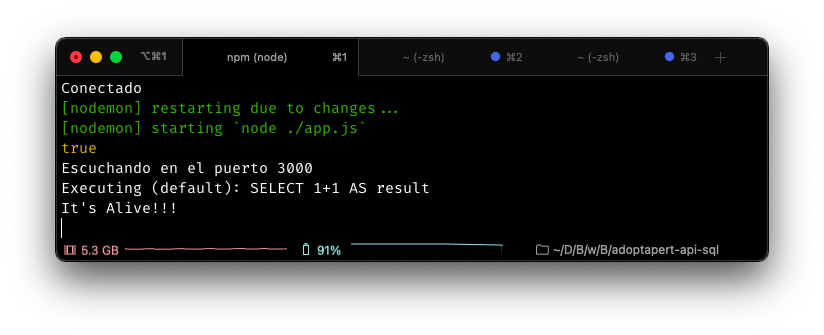

# Ejemplo 1 - Sequelize

## Objetivo

Utilizar una ORM para manipular la base de datos de MySQL.

## Requerimientos

Contar con el código de la API que estaba en desarrollo desde la sesión 5.

## Desarrollo

A continuación prepararemos el código de la API de adopta-pet para poder subirlo a github y compartirlo de manera segura.

### Configuración de la base de datos.

Con sequelize ya instalado lo siguiente es configurar nuestra conexión a la base de datos usando sequelize, para hacer esto lo hacemos de la siguiente manera:

1. Importamos en el archivo **app.js** sequielize.

```javascript
const Sequelize = require('sequelize')
```

2. Configuramos con los datos de conexión de nuestra base de datos.

```javascript
const sequelize = new Sequelize(<database>, <username>, <password>, {
  host: <host>,
  // una de estas opciones dependiendo el gestor de la base
  dialect: <'mysql'|'sqlite'|'postgres'|'mssql'>,
})
```

Por ejemplo

```javascript
const sequelize = new Sequelize('adoptapet', 'root', 'abc123', {
  host: 'localhost:3306',
  // una de estas opciones dependiendo el gestor de la base
  dialect: 'mysql',
})
```

3. Podemos verificar que la conexión funciona como sigue:

```javascript
sequelize.authenticate()
.then(() => {
  console.log('It's alive!!!!);
})
.catch(err => {
  console.log('No se conecto :(')
})
```

4. Corremos nuestro proyecto con:

```bash
npm run dev
```

Y debería mostrarnos en la consola lo siguiente:



### Modelos

Para representar las entidades de nuestro proyecto de una forma que Sequelize lo relacione con una tabla en la base de datos se define el modelo de ésta utilizando el método `define()`.

```javascript
const Modelo = sequelize.define('modelo',{
  <atributo> : <características>
  ...
  },
  { tablename : <nombre de la tabla que representa>})
```

Como ejemplo vamos a definir el modelo para Usuario, en el archivo **models/Usuario.js** comentamos el código que tenemos hasta ahorita y agregamos lo siguiente

```javascript
// importamos por separado los métodos de Sequelize y los tipos de dato.
const { Sequelize, DataTypes } = require('sequelize');
// importamos sequelize con la opción de memory para forzar al gestor a almacenarla en la memoria.
const sequelize = new Sequelize('mysql::memory:');

//creamos el modelo para usuario
const Usuario = sequelize.define('Usuario', {
  id: {
    // se indica el tipo de dato de la columna.
    type: DataTypes.INTEGER,
    // indicamos que este campo es llave primaria
    primaryKey : true
  },
  username: {
    type: DataTypes.STRING,
    // indicamos que el campo no admite valores null
    allowNull: false
  },
  nombre: DataTypes.STRING,
  apellido: DataTypes.STRING,
  email: DataTypes.STRING,
  password: DataTypes.STRING,
  ubicacion: DataTypes.STRING,
  telefono: DataTypes.STRING,
  bio: DataTypes.STRING,
  fotos: DataTypes.STRING,
  tipo : DataTypes.INTEGER
  // le decimos a que tabla de nuestra base de datos corresponde.
},{ tableName: 'usuario'});

// exportamos el modelo.
module.exports = Usuario;
```

La lista de los tipos de dato y su representación en Sequelize, se pueden consular en el siguiente [enlace](https://sequelize.org/master/manual/model-basics.html#data-types).

### CRUD para Usuarios

Ya con el modelo creado podemos usarlo para definir el CRUD de usuarios en el archivo `controllers/usuario.js`.

Comentamos el código que simula las acciones, e importamos el modelo de `Usuario`.

```javascript
const Usuario = require('../models/Usuario')
````

Ahora definimos cada una de las funciones

- **CREATE** 

Para crear un nuevo registro de Usuario se usa los métodos `build()` y `save()`. De la siguiente forma:

```javascript
function crearUsuario(req, res,next) {
  // construye una instancia del modelo Usuario con los argumentos que recibe en la petición
  const usr = Usuario.build(req.body)
  // Guarda esta instancia, es hasta este momento que se modifica la base de datos.
  usr.save().then(user => {
    return res.status(201).json(user.toAuthJSON())
  }).catch(next);
}
```

- **READ**

Para encontrar los usuarios se usa el método `findAll()`.

```javascript
function obtenerUsuarios(req, res) {
  // Hace una consulta en la base de datos.
  User.findAll().then(users => {
    return res.json(users)
  }).catch(error => {
    return res.sendStatus(401)
  })
}
```

Para búsquedas mas especificas, es decir, con restricciones, se pueden usar los campos `atributes` para especificar que columnas se quieren recuperar y `where` para poner restricciones. 

```javascript
Model.findAll({
  attributes: [<columna1>, <columna2>, ...],
  where: {
    <condición>
  }
});
```

También se pueden usar los métodos `find` para que regrese sólo el primer registro que encuentra en la consulta  o `findByPk` para que se haga una búsqueda por llave primaria. Puedes ver la documentación en el siguiente [enlace](https://sequelize.org/master/manual/model-querying-basics.html#simple-select-queries).

- **UPDATE** 

Primero se modifica localmente el usuario con el método `create` y después se usa el método `save`.

```javascript
function modificarUsuario(req, res,next) {
  // Se crea un usuario con el id del que se quiere modificar y los cambios descritos en el body
  const usr = User.create({
    id : req.params.id,
    ...req.body
  })
  // Se guarda en la DB
  usr.save().then(user => {
    return res.status(201).json(user.toAuthJSON())
  }).catch(next);
}
```

- **DELETE**

Para eliminar un registro, primero se busca por su `id`  y si existe se utiliza el método `destroy` para eliminarlo permanentemente de la base de datos.

```javascript
function eliminarUsuario(req, res) {
  // Usamos findByPK para buscar al usuario por su id
  const usr = User.findByPk(req.usuario.id);
  if (usr === null){
    // si no existe lanzamos un 400 
    return res.sendStatus(401)
  } else {
    // Si existe, lo eliminamos
    usr.destroy().then(usr => {
      return res.status(200)
    }).catch(err => {
      return res.sendStatus(500)
    })
  }
}
```

### Relaciones

Para definir las relaciones entre las tablas de la base de dato, se utilizan los siguientes métodos: 

- `hasOne` para cuando la relación es hacía un registro de la tabla destino (uno a uno).
- `hasMany` para cuando la relación es hacía muchos registros de la tabla destino (uno a muchos).

Puedes consultar la documentación de estos métodos en la siguiente [liga](https://sequelize.org/v5/manual/associations.html).


[`Atrás: Sesión 08`](../README.md) | [`Siguiente: Reto 01`](../Reto-00)
