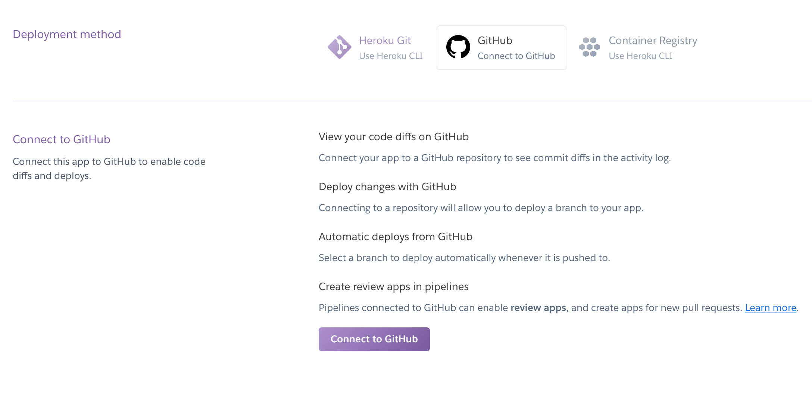

# Ejemplo 2 - Deploy con Heroku

## Objetivo

Conocer una de las plataformas más sencillas para lanzamiento de aplicaciones de Node.js

## Requerimientos

- ¿Recuerdas tus lecciones con GitHub?. Necesitas contar con el código del API en tu cuenta de GitHub. 
- Ejecuta los pasos necesarios para llevarlo a cabo.

## Desarrollo

Heroku es una plataforma que nos permite saltarnos muchos pasos de configuración de arquitectura y lanzar una aplicación en sencillos pasos.

Aunque no es lo óptimo para proyectos grandes y con necesidades muy específicas, nos permite probar aplicaciones de manera rápida y sin dolores de cabeza, y también acercarnos a comprender muchos conceptos de deploy de manera rápida, aunque no estemos conscientes de todas las implicaciones que conlleva por detrás cada configuración.

En pocas palabras, es recomendable utilizar Heroku cuando estamos en una etapa de desarrollo y validación de una idea para un proyecto.

1. Entra al sitio oficial de Heroku: [https://www.heroku.com/](https://www.heroku.com/)
2. Crea tu cuenta en Heroku eligiendo Node.js como tu *Primary development language*
3. Una vez que hayas accedido verás una pantalla como la siguiente.

    

    Da click sobre el botón "Create a new app".

4. Elige un nombre y crea tu app.

    

5. Ahora en la pestaña 'settings' configura las variables de entorno para producción.

    Da click en el botón "Reveal Config Vars"

    

    **Es importante que la variable `PORT` tenga el valor `80`** 

    

Es recomendable que en `MONGODB_URI` cambies el nombre de la base de datos para así comenzar con una base de datos limpia donde solo se almacenará información del ambiente de producción.
ej. `MONGODB_URI=mongodb+srv://<username>:<password>@<cluster-production>.mongodb.net/<nombre_db_production>?retryWrites=true&w=majority`

En el método de deployment elige Github y conecta tu cuenta de Github.

1. Busca tu repositorio y da click en conectar.

    

2. Una vez conectado ve a la sección *Manual Deploy* y presiona el botón "Deploy branch"

    

3. Una vez hecho lo anterior, presiona el botón "Open app" ubicado en el lado superior derecho de la interfaz de Heroku.

    Esto abrirá la url de tu API, ahora verifica que esté funcionando dirigiendote al path */v1*

    Si todo está bien configurado, verás un mensaje como el siguiente:

    
